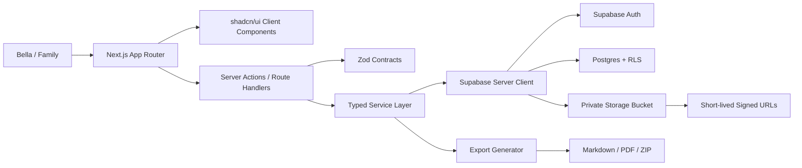

# Bella Care Tracker - Architecture

## Overview

Bella Care Tracker is a private family-facing health tracking app built with Next.js, shadcn/ui, Supabase, and Vercel.

The application should centralize:

- Pain and flare logs
- Photo/video uploads
- Left/right color and temperature comparisons
- Timeline of historical and new medical events
- Diagnostic tree and evidence links
- Decisions and appointment prep
- Medication/procedure response tracking
- Clinician-ready exports
- Full family-owned data export

The architecture is intentionally simple: one Next.js app, one Supabase project, private object storage, and a typed server-side service layer.

## System Diagram



## Stack

- **App framework:** Next.js App Router
- **UI:** shadcn/ui, Tailwind CSS, lucide-react
- **Forms:** react-hook-form + `@hookform/resolvers/zod`
- **Validation/contracts:** Zod
- **Database:** Supabase Postgres
- **Auth:** Supabase Auth
- **Storage:** Supabase Storage private buckets
- **Hosting:** Vercel
- **Testing:** Vitest and Playwright
- **CI:** GitHub Actions

## Ownership Boundary

Codex owns backend architecture:

- Supabase schema
- migrations
- RLS policies
- storage policies
- server actions / route handlers
- service layer
- import/export scripts
- shared Zod contracts
- seed data

Claude owns frontend implementation:

- app shell
- shadcn/ui screens
- responsive forms
- timeline UI
- diagnostic tree UI
- charts
- upload UX
- flare mode UX
- empty/loading/error states

Contract rule:

- Frontend code calls backend functions and imports shared contracts.
- Frontend code should not query Supabase tables directly.
- Schema or server action signature changes require backend-ticket coordination.

## Application Layers

### 1. UI Layer

Location:

- `app/` routes and route groups
- `components/`
- `components/ui/`

Responsibilities:

- Render screens and forms.
- Use shadcn/ui primitives.
- Use shared Zod schemas for form validation.
- Keep data-entry flows fast on mobile.
- Avoid medical logic that belongs in backend services.

Client components are appropriate for:

- Flare mode
- Uploads
- Photo comparison
- Interactive forms
- Timeline filters
- Charts

Server components are appropriate for:

- Read-heavy dashboards
- Initial timeline load
- Diagnostic tree detail pages
- Source/library views

### 2. Server Boundary

Location:

- `server/actions/`
- `server/routes/` if route handlers are needed

Responsibilities:

- Validate all inputs with Zod.
- Enforce role-aware operations.
- Call service-layer functions.
- Return typed DTOs to frontend.
- Hide Supabase implementation details from UI.

Preferred mutation shape:

```ts
export async function createEntry(input: CreateEntryInput): Promise<EntryDTO>;
```

Do not expose raw Supabase client usage to UI components.

### 3. Service Layer

Location:

- `server/services/`

Modules:

- `auth`
- `entries`
- `flares`
- `attachments`
- `vasomotor`
- `timeline`
- `diagnoses`
- `evidence`
- `decisions`
- `schedule`
- `medications`
- `procedures`
- `sources`
- `exports`
- `metrics`
- `audit`

Responsibilities:

- Implement business rules.
- Normalize query results.
- Compute derived values such as temperature deltas and flare duration.
- Write audit logs.
- Apply soft-delete behavior.
- Generate export data.

### 4. Data Layer

Location:

- Supabase Postgres
- migrations under the chosen migration tool

Principles:

- Postgres is source of truth.
- RLS enabled on every table at creation time.
- Soft-delete with `deleted_at` for medical records.
- All timestamps stored in UTC.
- Client renders dates in user timezone.
- Default page size is `50`; max page size is `200`.
- Use indexes for timeline/date filters, linked entities, and soft-delete.

## Database Domains

Core tables:

- `roles`
- `profiles`
- `body_regions`
- `symptoms`
- `triggers`
- `entries`
- `entry_regions`
- `entry_symptoms`
- `entry_triggers`
- `vasomotor_measurements`
- `events`
- `attachments`
- `attachment_links`
- `diagnoses`
- `evidence_links`
- `decisions`
- `appointments`
- `medications`
- `medication_responses`
- `sources`
- `tasks`
- `audit_log`

Important model notes:

- `entries` covers Pain Book, Log Book, and flare-related entries.
- `vasomotor_measurements` stores clinician-readable left/right temperature and color pairs.
- `events` covers historical timeline items, procedures, imaging, consults, and tests.
- `diagnoses` are editable diagnostic nodes, not fixed medical truth.
- `evidence_links` connect evidence to diagnostic nodes with direction: supports, weakens, neutral, pending.
- `attachment_links` is polymorphic for flexibility; referential integrity is application-enforced unless later replaced by per-type junction tables.

## Auth And Roles

Auth provider:

- Supabase Auth

Initial auth decision:

- Prefer email magic link for family users.
- Consider password + MFA for primary/caregiver accounts.

Roles:

- `primary`: Bella
- `caregiver`: family member managing logs/schedule
- `viewer`: family read-only
- `clinician_readonly`: future limited-access role

Access rules:

- RLS denies by default.
- Primary/caregiver can create and update normal records.
- Viewer and clinician read-only cannot mutate records.
- Soft-deleted rows are hidden from normal reads.
- No table should be publicly readable.

## Storage Architecture

Storage provider:

- Supabase Storage

Bucket policy:

- Private bucket only.
- No public file URLs.
- Signed, short-lived URLs for previews and downloads.

Supported files:

- images
- videos
- PDFs
- markdown/text files

Upload requirements:

- Max upload size initially `50 MB`.
- Allowed mime types enforced.
- Server-side mime sniffing.
- Strip GPS EXIF metadata from image uploads.
- Preserve capture timestamp when available.
- Store file metadata in `attachments`.
- Link files through `attachment_links`.

## Key Backend APIs

Entries:

- `createEntry`
- `updateEntry`
- `softDeleteEntry`
- `getEntry`
- `listEntries`
- `listEntriesByDateRange`

Flares:

- `startFlare`
- `addFlareCheckpoint`
- `updateFlare`
- `endFlare`
- `getActiveFlare`

Attachments:

- `createUploadUrl`
- `createAttachment`
- `linkAttachment`
- `getSignedAttachmentUrl`
- `softDeleteAttachment`

Vasomotor measurements:

- `createVasomotorMeasurement`
- `updateVasomotorMeasurement`
- `softDeleteVasomotorMeasurement`
- `listVasomotorMeasurements`

Timeline:

- `listTimelineItems`

Diagnostic tree:

- `createDiagnosis`
- `updateDiagnosis`
- `softDeleteDiagnosis`
- `listDiagnoses`
- `createEvidenceLink`
- `updateEvidenceLink`
- `removeEvidenceLink`
- `mergeDiagnosisNodes`
- `splitDiagnosisNode`

Decisions:

- `createDecision`
- `updateDecision`
- `softDeleteDecision`
- `listDecisions`
- `linkDecisionEvidence`

Schedule:

- appointment CRUD
- task CRUD

Exports:

- `generateClinicianExportPacket`
- `generateBulkDataExport`

Metrics:

- `getDashboardMetrics`
- `getTrendMetrics`

## Flare Mode Architecture

Flare mode is the highest-value workflow.

Backend behavior:

- One active flare per user by default.
- Active flare is represented by an entry/session record.
- Checkpoints preserve exact timestamps.
- End flare computes duration and recovery metadata.
- Photos, videos, symptoms, triggers, meds, and vasomotor measurements link back to the flare entry.

Checkpoints:

- start
- 30m
- 60m
- 120m
- 6h
- 12h
- 24h
- 48h
- custom

Frontend behavior:

- Global "Start flare" action.
- Active flare status visible across the app.
- Mobile-first quick entry.
- Minimal-tap capture of pain score, trigger, body region, photo pair, and temperature pair.

## Vasomotor Capture Architecture

This is a first-class MVP workflow.

Data captured:

- measured_at
- body site
- left temperature Celsius
- right temperature Celsius
- computed delta Celsius
- left color
- right color
- lighting notes
- context
- linked left/right images

Contexts:

- baseline
- active flare
- recovery
- after pressure trigger
- after medication
- after procedure
- custom

Clinical purpose:

- Make episodic color/temperature changes objective.
- Support CRPS/Budapest sign documentation.
- Provide comparison panels in export packets.

## Timeline Architecture

The timeline should not be a single table. It is a normalized read model generated from multiple domains.

Sources:

- entries
- flares
- events
- appointments
- medication changes
- procedure/test records
- decisions
- sources/uploads
- diagnosis updates

Return shape:

- `TimelineItem[]`

Filters:

- date range
- item type
- body region
- symptom
- trigger
- diagnostic branch
- flare only
- media only

Pagination:

- default `50`
- max `200`

## Diagnostic Tree Architecture

Diagnostic nodes are mutable clinical reasoning records.

Each node tracks:

- status
- confidence
- why considered
- evidence for
- evidence against
- tests needed
- treatment implications
- open questions
- linked evidence
- last reviewed date

Nodes must support:

- merge
- split
- status change
- evidence link updates
- audit history

The diagnostic tree should preserve uncertainty. It must not imply that a suspected branch is confirmed unless the status says so.

## Export Architecture

### Clinician Export Packet

Inputs:

- date range
- diagnostic branch
- body region
- flare-only toggle
- include photos
- include procedure summaries

Output:

- Markdown first
- PDF later

Packet sections:

- working diagnosis paragraph
- confirmed-by criteria for active/supported branches
- current medications
- active decisions
- upcoming appointments/tests
- flare frequency and recovery time
- selected photo comparisons and temperature deltas
- procedure impact summaries
- key timeline items
- clinician questions

### Bulk Data Export

Purpose:

- Data ownership and platform exit.

Output:

- structured JSON or CSV
- uploaded files
- generated export packets
- zip archive

Normal export excludes soft-deleted rows unless primary/caregiver explicitly includes them.

## Audit And Soft Delete

Soft-delete:

- Use `deleted_at`.
- Normal reads exclude deleted rows.
- Hard delete should be rare and explicitly implemented only if needed.

Audit log should record:

- actor
- action
- entity type
- entity id
- before JSON
- after JSON
- timestamp

Always audit:

- decisions
- diagnoses
- sources
- medication changes
- appointments
- deletions
- merge/split diagnostic node actions

## Offline Capture Design

Offline implementation can come later, but architecture should avoid blocking it.

Design constraints:

- Preserve client-side timestamps.
- Queue entries locally if network is unavailable.
- Stage attachments locally until upload succeeds.
- Sync should be idempotent.
- Conflict resolution should prefer append-only behavior for medical observations.

The offline design spike should happen before deep flare-mode implementation so frontend choices do not block future offline capture.

## Security Baseline

This is a family app, not a compliance-heavy healthcare platform, but it still contains sensitive health data.

Required:

- RLS enabled on every table.
- No public storage buckets.
- Short-lived signed URLs.
- MFA for primary/caregiver where practical.
- Session timeout.
- GPS EXIF stripping.
- No third-party analytics or trackers for medical text/events.
- Negative cross-account access tests.
- File path traversal checks.
- Security checklist before production sharing.

## Deployment

Production:

- Vercel for Next.js
- Supabase for DB/Auth/Storage

CI:

- GitHub Actions
- typecheck
- lint
- unit tests
- Playwright tests when available

Preview:

- Vercel preview deployments for PRs
- Supabase branch/dev project strategy to be decided in BE-000

## Directory Plan

Expected app structure:

```text
app/
  DESIGN.md
  ARCHITECTURE.md
  TICKETS.md
  package.json
  src/
    app/
    components/
      ui/
    features/
      entries/
      flares/
      uploads/
      vasomotor/
      timeline/
      diagnoses/
      decisions/
      schedule/
      medications/
      procedures/
      sources/
      exports/
      dashboard/
    server/
      actions/
      services/
      contracts/
      supabase/
      audit/
    lib/
    test/
  supabase/
    migrations/
    seed/
```

## First Implementation Slice

The first useful end-to-end slice should be:

1. Tooling and CI baseline.
2. Supabase schema with RLS enabled.
3. Auth/profile/role setup.
4. Shared contracts.
5. Entries API.
6. Private upload API.
7. Pain Book / Log Book UI.
8. Upload component.

This produces a working capture app before flare mode and diagnostic tree are layered on.
