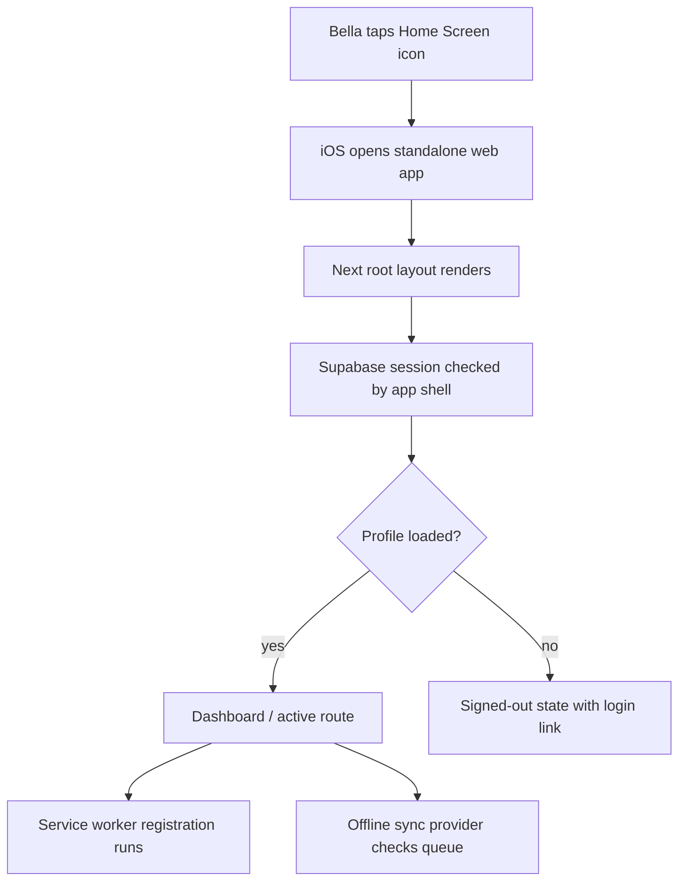
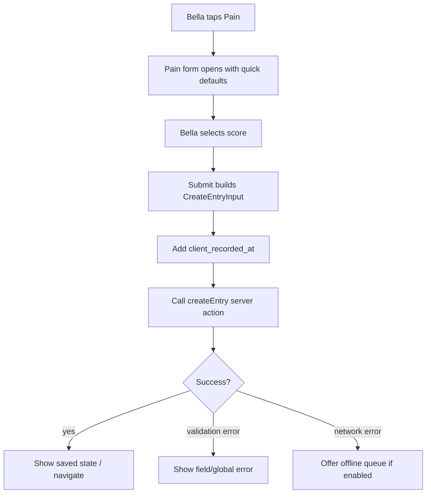
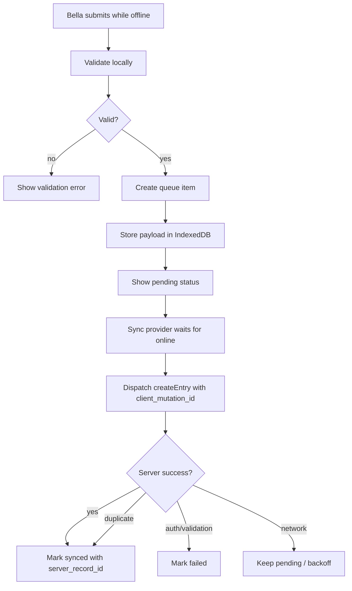
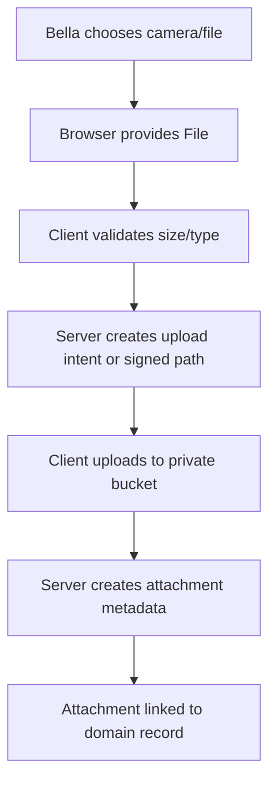
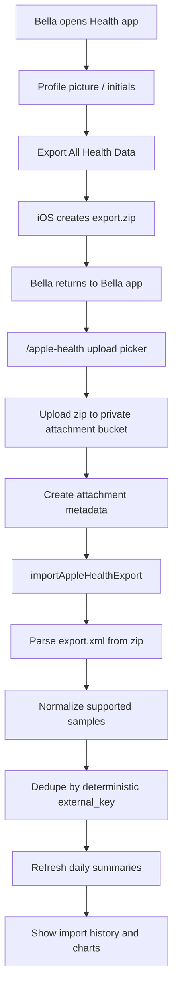
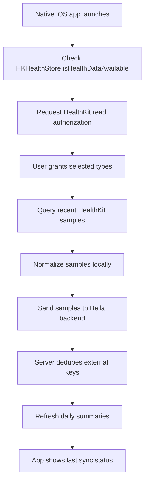

# Bella Private iPhone Companion Plan

**Decision:** implement the first mobile version as an installable private web
app inside the existing Next.js application, not as a native iOS app.

**Target user:** Bella.

**Distribution model:** Bella opens the deployed HTTPS app in Safari and adds it
to the iPhone Home Screen. No App Store submission, no TestFlight dependency,
and no `.ipa` distribution in the first release.

**Primary goal:** make capture fast, reliable, and private on Bella's iPhone.
The mobile app should reduce friction for logging pain, flares, medications,
photos, and appointment context. It is not a new product surface; it is the
same family-scoped care tracker optimized for one real device.

## Why This Shape

The repository already contains a substantial private care tracker in `app/`:

- Next.js App Router, React, TypeScript, Tailwind, shadcn-style primitives.
- Supabase auth, row-level security, storage, migrations, and seed data.
- Existing mobile shell:
  - `src/components/shell/mobile-nav.tsx`
  - `src/components/shell/desktop-nav.tsx`
  - `src/components/shell/active-flare-banner.tsx`
  - `src/components/shell/onboarding-gate.tsx`
- Existing high-value mobile flows:
  - `/pain-book`
  - `/flare`
  - `/log-book`
  - `/vasomotor`
  - `/medications`
  - `/schedule`
  - `/timeline`
  - `/sources`
  - `/import`
  - `/agent`
- Server boundary is already established:
  - frontend imports contracts from `src/server/contracts`
  - frontend calls server actions from `src/server/actions`
  - frontend does not query Supabase tables directly
- Existing upload component already supports mobile capture:
  - `src/components/upload/attachment-uploader.tsx`
  - camera input uses `accept="image/*,video/*"` and `capture="environment"`
- Existing backend design spike for offline capture:
  - `docs/backend/BE-021-offline-capture.md`

Because the current app is already responsive and private, the fastest useful
path is to make it a proper Home Screen app, then tighten the handful of flows
Bella uses repeatedly.

Native iOS should stay a later option. A real native companion would require a
mobile API boundary because Next server actions are not a stable public mobile
API. It would also require Apple signing and device distribution. For a single
private user, that is operational drag without enough immediate benefit.

## Vocabulary

**Mobile app**

In this document, "mobile app" means the installable Home Screen web app version
of the existing Next.js app.

**PWA**

Progressive Web App behavior for this repo means:

- Home Screen icon and standalone display.
- Mobile-safe metadata and icons.
- iPhone-safe viewport and safe-area layout.
- Minimal service worker used carefully.
- Optional offline capture queue for selected create-only workflows.
- Optional web push reminders after the core mobile app is stable.

**Native wrapper**

A later Capacitor or Expo shell that loads the app in a native iOS WebView or
shares code with a native React Native implementation. This is explicitly not
part of the first implementation.

**Offline**

Offline does not mean the entire medical record is browsable without network.
Offline means Bella can capture selected observations when the network is bad
and the app will sync them later without duplicating records.

## Product Principles

1. Fast capture beats full desktop parity.
2. The mobile Home Screen app should open directly into useful work.
3. The app must not silently lose a symptom, flare checkpoint, or medication
   response because the connection dropped.
4. The app must not cache protected health information casually.
5. Offline storage is a privacy tradeoff and must be visible, bounded, and
   clearable.
6. Any queued write must preserve the time Bella observed the event, not merely
   the later sync time.
7. All writes still go through existing server actions and Supabase RLS.
8. Native iOS distribution should be avoided unless a specific iOS limitation
   blocks a high-value flow.

## Non-Goals For The First Mobile Release

- No App Store listing.
- No TestFlight-first workflow.
- No native Swift app.
- No React Native rewrite.
- No direct Supabase table access from mobile components.
- No offline browsing of the full timeline, documents, images, or exports.
- No DICOM viewer.
- No background medical analysis on-device.
- No hidden analytics or third-party session recording.
- No attempt to replace clinician judgment or emergency guidance.

## User Experience Target

Bella should be able to do the following from the iPhone Home Screen app:

1. Open the app and land on an immediately useful mobile dashboard.
2. Start a flare in less than 15 seconds.
3. Add a flare checkpoint in less than 10 seconds when a flare is active.
4. Log current pain in less than 15 seconds.
5. Log medication response with before/after pain scores.
6. Take or attach left/right vasomotor photos.
7. Add a freeform note with optional body regions, symptoms, triggers, and
   attachments.
8. See whether data is online, queued, syncing, synced, or failed.
9. Retry failed queued writes.
10. Export queued text before clearing local offline data.
11. Continue using the existing desktop app without data model divergence.

## Release Strategy

Build this in five phases.

### Phase 1: Installable Home Screen App

Make the existing app install cleanly on iPhone and behave like a focused app
when launched from the Home Screen.

Deliverables:

- App manifest.
- iOS Home Screen metadata.
- App icons.
- Safe-area layout fixes.
- Standalone-mode detection.
- Install instructions for Safari.
- Conservative service worker that does not cache PHI pages.
- Mobile QA checklist.

Expected effort: small.

Risk: low.

### Phase 2: Mobile Capture Refinement

Keep the existing backend and routes, but make the high-frequency mobile flows
feel purpose-built on iPhone.

Deliverables:

- Mobile dashboard tuned for "what should Bella do right now?"
- Quick capture entry points.
- Better active flare state on mobile.
- Shorter pain, flare checkpoint, medication response, and vasomotor capture.
- Reduced scrolling in repeated workflows.
- Better keyboard and input modes.
- Better file/camera affordances.

Expected effort: moderate.

Risk: medium, because it touches user-facing forms.

### Phase 3: Offline Capture Queue

Add a create-only offline queue for selected mutation types.

Deliverables:

- IndexedDB queue.
- Operation adapters for selected creates.
- Local entity references for dependent offline flare records.
- IndexedDB photo staging for vasomotor evidence.
- Idempotency support on the server.
- Pending queued items rendered in Timeline with a local-only sync badge.
- Visible sync status.
- Retry, failure, and clear/export controls.
- Foreground sync on app launch, online event, and user tap.
- Tests for duplicate prevention and queue ordering.

Expected effort: medium to high.

Risk: high, because it touches medical data integrity and local PHI storage.

### Phase 4: Optional Push Reminders

Only after the core mobile app is stable, add opt-in reminders for appointments,
tasks, medication follow-up, and flare checkpoints.

Deliverables:

- Web Push subscription storage.
- Notification permission UI.
- Push service worker handler.
- Server-side push sender.
- Reminder scheduling source of truth.
- Unsubscribe and device management.

Expected effort: medium.

Risk: medium, mostly around permission UX and delivery reliability.

### Phase 5: Native Wrapper Decision

Revisit native only if a concrete limitation remains after Phases 1-4.

Potential reasons to go native later:

- Reliable local scheduled notifications are required.
- Background sync behavior is not good enough.
- Camera/file handling in Safari is insufficient.
- Home Screen web app auth/session behavior is unacceptable.
- Apple Health integration needs more than manual export upload.

Expected effort: medium for a wrapper, high for a real native app.

Risk: high operationally because of Apple signing and private distribution.

## Phase 1 Implementation Details

### 1. Add Next.js Manifest

Create:

```text
src/app/manifest.ts
```

Purpose:

- Defines app name, short name, start URL, display mode, colors, and icons.
- Gives non-iOS browsers a standard installable web app description.
- Keeps install metadata in code rather than hand-written JSON.
- Uses `/` as the `start_url` so iOS does not preserve a stale login redirect
  target across Home Screen launches. The app router decides whether Bella
  lands on the dashboard, login, onboarding, or a future quick-capture route.

Expected shape:

```ts
import type { MetadataRoute } from "next";

export default function manifest(): MetadataRoute.Manifest {
  return {
    name: "Bella Care Tracker",
    short_name: "Bella",
    description: "Private care tracker for Bella.",
    start_url: "/",
    scope: "/",
    display: "standalone",
    background_color: "#f8fafc",
    theme_color: "#196b75",
    icons: [
      {
        src: "/icons/icon-192.png",
        sizes: "192x192",
        type: "image/png",
      },
      {
        src: "/icons/icon-512.png",
        sizes: "512x512",
        type: "image/png",
      },
      {
        src: "/icons/icon-maskable-512.png",
        sizes: "512x512",
        type: "image/png",
        purpose: "maskable",
      },
    ],
  };
}
```

Use the existing color palette:

- `--background: 210 20% 98%`
- `--primary: 188 64% 28%`

Do not use a loud or medical-emergency-looking icon. This app is private and
should look calm on Bella's phone.

### 2. Add iOS Metadata In Root Layout

Update:

```text
src/app/layout.tsx
```

Add `viewport` and expanded `metadata`.

Implementation notes:

- Include `viewportFit: "cover"` so CSS safe-area insets can be used.
- Include `appleWebApp.capable = true`.
- Include an Apple-specific app title.
- Use `appleWebApp.statusBarStyle = "black-translucent"` intentionally. With
  `viewport-fit=cover`, the page owns the top safe area; the shell must add
  `env(safe-area-inset-top)` padding and keep status-bar content readable.
- Include `formatDetection.telephone = false` unless a view deliberately links
  phone numbers.
- Include icons using the generated icon files.
- Keep the existing app title and description from `strings`.

Expected shape:

```ts
import type { Metadata, Viewport } from "next";

export const viewport: Viewport = {
  width: "device-width",
  initialScale: 1,
  viewportFit: "cover",
  themeColor: "#196b75",
};

export const metadata: Metadata = {
  title: strings.app.name,
  description: strings.app.tagline,
  applicationName: strings.app.name,
  appleWebApp: {
    capable: true,
    title: "Bella",
    statusBarStyle: "black-translucent",
  },
  formatDetection: {
    telephone: false,
  },
  icons: {
    icon: [
      { url: "/icons/icon-192.png", sizes: "192x192", type: "image/png" },
      { url: "/icons/icon-512.png", sizes: "512x512", type: "image/png" },
    ],
    apple: [{ url: "/apple-touch-icon.png", sizes: "180x180" }],
  },
};
```

### 3. Generate Icons

Create:

```text
public/apple-touch-icon.png
public/icons/icon-192.png
public/icons/icon-512.png
public/icons/icon-maskable-512.png
```

Icon requirements:

- PNG format.
- No transparent-only edges for the Apple touch icon.
- Legible at small sizes.
- Should not include PHI, initials that expose health context, or anything
  alarming.
- Use the product color system rather than a new palette.
- Prefer an abstract mark tied to care tracking, not a hospital cross.

The first pass can use a generated or simple designed raster asset. If a brand
system appears later, replace the icon set in one pass.

### 4. Fix Safe-Area Layout

Update:

```text
src/app/globals.css
src/components/shell/mobile-nav.tsx
src/app/(app)/layout.tsx
```

Problems to solve:

- Home Screen web apps on iPhone can use the full screen area.
- The bottom nav must not sit under the iOS home indicator.
- Sticky top chrome must not clash with the status bar.
- Main content bottom padding must account for the fixed bottom nav plus the
  safe-area inset.

CSS tokens to add:

```css
:root {
  --safe-top: env(safe-area-inset-top, 0px);
  --safe-right: env(safe-area-inset-right, 0px);
  --safe-bottom: env(safe-area-inset-bottom, 0px);
  --safe-left: env(safe-area-inset-left, 0px);
  --mobile-bottom-nav-height: 4rem;
}
```

Expected changes:

- Mobile header gets `padding-top: var(--safe-top)` when standalone/fullscreen.
- Bottom nav gets `padding-bottom: var(--safe-bottom)`.
- Main content mobile bottom padding becomes:

```css
calc(var(--mobile-bottom-nav-height) + var(--safe-bottom) + 1rem)
```

Avoid using viewport-width based font scaling. It causes unpredictable text
wrapping in form controls.

### 5. Add Standalone Detection

Create:

```text
src/lib/mobile/standalone.ts
src/components/mobile/install-instructions.tsx
```

Purpose:

- Detect whether the app is running as a Home Screen app.
- Show install instructions only when helpful.
- Hide browser-only copy in standalone mode.

Detection logic:

```ts
export function isStandaloneDisplay(): boolean {
  if (typeof window === "undefined") return false;
  return (
    window.matchMedia("(display-mode: standalone)").matches ||
    // iOS Safari legacy signal:
    (window.navigator as Navigator & { standalone?: boolean }).standalone ===
      true
  );
}
```

Install instruction behavior:

- Show only on iPhone Safari when not standalone.
- Do not show every time. Dismiss for at least 14 days using local storage.
- Do not show on desktop.
- Do not block use of the app.
- Copy should be short:
  - "Open Share"
  - "Add to Home Screen"
  - "Name it Bella"

Potential placement:

- Settings page.
- Onboarding page.
- A dismissible mobile-only banner on dashboard after sign-in.

### 6. Add A Conservative Service Worker

Create:

```text
public/sw.js
src/components/mobile/service-worker-registration.tsx
```

Register from the root app shell after hydration.

Important privacy rule:

Do not cache authenticated HTML responses or Supabase signed attachment URLs.
The app contains private health information. Offline support should come from
the explicit IndexedDB queue, not from a broad page cache.

Initial service worker behavior:

- Cache static Next assets under `/_next/static/`.
- Cache icons and install assets.
- Cache a generic offline page.
- For navigation requests:
  - try network first
  - if network fails, return `/offline`
  - do not serve a stale authenticated page
- For `POST`, `PUT`, `PATCH`, `DELETE`:
  - never intercept for caching
  - let the request fail normally
- For Supabase storage signed URLs:
  - never cache
- For `/login`, auth callback routes, and any future `/api/auth/*`:
  - never cache

Service worker cache names must be versioned:

```js
const STATIC_CACHE = "bella-static-v1";
const OFFLINE_CACHE = "bella-offline-v1";
```

Add an activation cleanup so old caches are deleted.

Do not implement background sync in the service worker in Phase 1. iOS support
and behavior are not reliable enough to make it the source of truth. Phase 3
will do foreground sync from the app runtime.

### 7. Add Offline Page

Create:

```text
src/app/offline/page.tsx
```

Purpose:

- Give Bella a clear state when the app cannot reach the network.
- Avoid a browser error page.
- Avoid showing stale medical data.

Content:

- "Offline"
- "Open the app again when the connection is back."
- If Phase 3 is complete, include queued item count.
- Link back to `/dashboard`.

Do not put sensitive record content on the offline page.

### 8. Install Instructions Runbook

Document in `README.md` or this file after implementation:

1. Deploy the app to a stable HTTPS URL.
2. On Bella's iPhone, open Safari.
3. Visit the app URL.
4. Sign in.
5. Tap Share.
6. Tap Add to Home Screen.
7. Name it `Bella`.
8. Launch from the Home Screen icon.
9. Confirm it opens without Safari address bars.
10. Confirm login persists after force-closing and reopening.

## Phase 2 Implementation Details

### 1. Mobile Dashboard Reframe

Current route:

```text
src/app/(app)/dashboard/page.tsx
```

The desktop dashboard can remain analytics-heavy. The mobile dashboard should
prioritize action.

Mobile dashboard order:

1. Active flare state:
   - if active: checkpoint button, end flare button, latest pain, elapsed time
   - if inactive: start flare button
2. Quick log row:
   - Pain
   - Note
   - Medication
   - Photo
3. Today:
   - upcoming appointment or task
   - last medication response
   - last pain entry
4. Recent timeline preview.
5. Charts lower down.

Do not remove desktop analytics. Use responsive composition so desktop keeps
the richer dashboard while mobile gets the task-first order.

### 2. Quick Capture Entry Point

Create either:

```text
src/app/(app)/quick/page.tsx
```

or keep quick capture embedded on `/dashboard`.

Preferred approach:

- Add a route `/quick` only if it meaningfully reduces complexity.
- Otherwise, add a `QuickCapturePanel` component used by dashboard and maybe
  the active flare view.

Potential files:

```text
src/components/mobile/quick-capture-panel.tsx
src/components/mobile/quick-capture-action.tsx
```

Actions:

- Pain
- Flare
- Medication response
- Vasomotor photo
- Freeform note

Each action should deep-link to the existing route with sensible defaults:

- `/pain-book/new?quick=1`
- `/flare`
- `/medications/responses/new?quick=1`
- `/vasomotor/new?quick=1`
- `/log-book/new?quick=1`

If the existing routes do not support query defaults cleanly, add support in
the page components rather than creating duplicate forms.

### 3. Pain Capture

Current relevant areas:

```text
src/app/(app)/pain-book/new/page.tsx
src/components/entries/entry-form.tsx
src/server/contracts/entries.ts
src/server/actions/entries.ts
```

Mobile requirements:

- Default `occurred_at` to now.
- Preserve `client_recorded_at` as the actual capture time.
- Pain score control must be thumb-friendly.
- Title should auto-fill to something useful if Bella does not type one.
- Notes should be optional and not visually dominate the form.
- Body region, symptoms, and triggers should be quick chips.
- Submit button must remain reachable above the bottom nav.
- After save, return to:
  - active flare page if logged from flare context
  - dashboard otherwise

Do not require excessive structured data. The mobile flow should accept a
minimal pain score plus optional note.

### 4. Flare Capture

Current relevant areas:

```text
src/app/(app)/flare/page.tsx
src/components/flares/flare-page-client.tsx
src/components/flares/flare-start-form.tsx
src/components/flares/flare-checkpoint-form.tsx
src/components/flares/end-flare-dialog.tsx
src/server/contracts/flares.ts
src/server/actions/flares.ts
```

Mobile requirements:

- If no flare is active:
  - primary action is Start Flare
  - pain and notes are enough to start
  - body region and symptoms are optional
- If flare is active:
  - primary action is Add Checkpoint
  - secondary action is End Flare
  - show elapsed time
  - show latest pain score
  - show next suggested checkpoint
- Checkpoint form:
  - default `checkpoint_at` to now
  - checkpoint type defaults based on elapsed time if possible
  - pain score first
  - notes second
  - symptoms optional

When offline queue is implemented, start flare and checkpoint are high-priority
queued operations. End flare is more delicate because it mutates an existing
record; queue it only after create-only flows are stable.

### 5. Medication Response Capture

Current relevant areas:

```text
src/app/(app)/medications/responses/new/page.tsx
src/components/medications/response-form.tsx
src/server/contracts/medications.ts
src/server/actions/medications.ts
```

Mobile requirements:

- Default `taken_at` to now.
- Medication select should prioritize active medications.
- Pain before and after fields should use the existing 0-10 control.
- The form should support "I just took this" even if after scores are unknown.
- Follow-up reminders are Phase 4, not required for first mobile release.
- The app should make it easy to edit later with 30m, 60m, or 120m values.

Offline queue MVP can support creating a medication response with the known
fields at capture time. Follow-up edits should remain online until update
idempotency and conflict behavior are designed.

### 6. Vasomotor Photo Capture

Current relevant areas:

```text
src/app/(app)/vasomotor/new/page.tsx
src/components/vasomotor/vasomotor-form.tsx
src/components/upload/attachment-uploader.tsx
src/server/contracts/vasomotor.ts
src/server/actions/vasomotor.ts
src/server/actions/attachments.ts
```

Mobile requirements:

- Camera capture must remain obvious.
- Left and right photo fields should be clearly labeled.
- Lighting notes should be easy to add but optional.
- Temperature fields should use numeric keyboards.
- Measurement time defaults to now.
- If a flare is active, offer linking to the active flare entry.

Offline attachments are complicated. The first offline release may queue text
metadata and require network for actual image upload. If offline photo capture
is included, store the image blobs in IndexedDB with strict size limits and a
visible "photos waiting to upload" state.

### 7. Freeform Log Capture

Current relevant areas:

```text
src/app/(app)/log-book/new/page.tsx
src/components/entries/entry-form.tsx
```

Mobile requirements:

- One large note field.
- Optional pain score.
- Optional body regions, symptoms, triggers.
- Attachments remain available.
- Minimal submit friction.

This is the fallback when Bella wants to record something quickly without
classifying it.

### 8. Navigation Adjustments

Current mobile bottom bar:

```text
const BOTTOM_BAR_HREFS = ["/dashboard", "/pain-book", "/flare", "/log-book"];
```

The existing bottom bar renders four fixed destinations plus `More`.

Recommended bottom bar for mobile:

- Dashboard
- Pain
- Flare
- Log
- More

Keep this for the first release. Do not churn navigation until real use shows a
better order.

Possible later change:

- Replace Log with Quick if Bella uses quick capture more than freeform notes.

### 9. Forms And Keyboard Behavior

Across mobile forms:

- Use `inputMode="numeric"` for integer pain values if a text/number input is
  used.
- Use `inputMode="decimal"` for temperatures.
- Use `autoComplete` only where appropriate.
- Avoid tiny select triggers.
- Avoid buttons below fixed nav.
- Ensure destructive actions are not next to primary submit buttons.
- Keep labels visible. Placeholder-only fields are not enough.
- Keep validation messages close to the field.
- Prevent layout jumps when dynamic sections open.

### 10. Apple Health Manual Import On Mobile

Current relevant areas:

```text
src/app/(app)/apple-health/page.tsx
src/components/apple-health/apple-health-uploader.tsx
src/components/apple-health/daily-summary-panel.tsx
src/components/apple-health/import-history-list.tsx
src/components/apple-health/raw-samples-panel.tsx
src/server/actions/apple-health.ts
src/server/contracts/apple-health.ts
src/server/services/apple-health.ts
docs/backend/APPLE_HEALTH_IMPORT.md
```

Mobile PWA reality:

- The Home Screen web app can upload an Apple Health `export.zip`.
- The Home Screen web app should not be expected to directly read HealthKit.
- Direct HealthKit read/sync requires a native iOS app with HealthKit
  entitlement, usage strings, and per-type user authorization.

First mobile release requirements:

- Make `/apple-health` reachable from mobile navigation or Settings.
- Keep the import flow explicitly manual.
- Add concise iPhone instructions:
  - open Health
  - tap profile picture or initials
  - tap Export All Health Data
  - return to Bella
  - upload the generated `export.zip`
- Keep warning copy visible because Apple exports can include broad health data.
- Show that repeat uploads are safe because imports dedupe samples.
- Show import progress distinctly from upload progress.
- Show import history after a successful import.
- Keep charts usable on narrow screens.
- Avoid making Apple Health data look like pain entries or diagnoses.

Supported first-release behavior:

- Manual full export upload.
- Repeat import dedupe.
- Daily summaries.
- Featured metric charts.
- Import history.
- Optional raw sample inspection.

Not supported in PWA first release:

- Automatic background HealthKit sync.
- One-tap HealthKit authorization.
- Incremental HealthKit observer queries.
- Reading Health data without the user manually exporting it.
- Writing Bella records back into Health.
- Importing clinical records through HealthKit.

Native trigger:

- If manual exports are too annoying or Bella needs frequent automatic updates,
  move Apple Health to the Phase 5 native-wrapper decision.
- Start with a small native HealthKit bridge only if the rest of the PWA is
  already working well.

## Phase 3 Offline Capture Details

### 1. Data Model

Use IndexedDB, not local storage.

Add a tiny IndexedDB wrapper. Recommended dependency:

```text
idb
```

Potential files:

```text
src/lib/offline/db.ts
src/lib/offline/queue.ts
src/lib/offline/operations.ts
src/lib/offline/sync.ts
src/lib/offline/types.ts
src/components/offline/offline-status-bar.tsx
src/components/offline/offline-queue-panel.tsx
src/components/offline/use-offline-sync.ts
```

IndexedDB database:

```text
bella-mobile-offline
```

Object stores:

```text
queue_items
queue_attachments
sync_events
```

`queue_items` shape:

```ts
type OfflineQueueItem = {
  id: string;
  family_id: string;
  actor_profile_id: string;
  operation: OfflineOperationName;
  payload: unknown;
  client_recorded_at: string;
  created_locally_at: string;
  idempotency_key: string;
  attachment_staging_ids: string[];
  depends_on_local_item_ids: string[];
  local_entity_refs: Record<string, string>;
  timeline_preview?: {
    occurred_at: string;
    title: string;
    kind:
      | "pain"
      | "freeform"
      | "flare"
      | "checkpoint"
      | "medication"
      | "vasomotor";
    summary?: string;
  };
  status: "pending" | "syncing" | "synced" | "failed";
  attempts: number;
  last_attempt_at?: string;
  last_error?: string;
  server_record_id?: string;
};
```

`queue_attachments` shape:

```ts
type OfflineAttachment = {
  id: string;
  queue_item_id: string;
  file_name: string;
  mime_type: string;
  size_bytes: number;
  blob: Blob;
  created_locally_at: string;
  status: "pending" | "uploading" | "uploaded" | "failed";
  uploaded_attachment_id?: string;
  last_error?: string;
};
```

`sync_events` shape:

```ts
type OfflineSyncEvent = {
  id: string;
  queue_item_id?: string;
  level: "info" | "warning" | "error";
  message: string;
  created_at: string;
};
```

### 2. Operation Allowlist

Do not create a generic "call any server action from offline" system. Use a
small allowlist.

MVP allowed operations:

```ts
type OfflineOperationName =
  | "entries.createPain"
  | "entries.createFreeform"
  | "flares.start"
  | "flares.createCheckpoint"
  | "medications.createResponse"
  | "vasomotor.createMeasurement";
```

Not allowed in MVP:

- updates
- deletes
- source linking
- diagnostic-tree edits
- decisions
- schedule edits
- import commit/reject flows
- AI agent messages
- exports

Reason:

Create-only observations are append-friendly and safer to retry. Updates and
deletes need conflict handling so the app does not overwrite newer server data.

### 3. Server Idempotency

Offline sync must be idempotent before it ships. Otherwise retries can duplicate
medical records.

Add `client_mutation_id` to create input schemas for queued create flows:

```text
src/server/contracts/entries.ts
src/server/contracts/flares.ts
src/server/contracts/medications.ts
src/server/contracts/vasomotor.ts
```

Schema pattern:

```ts
client_mutation_id: uuidSchema.optional();
```

Add nullable columns to the relevant tables:

```sql
alter table public.entries
  add column client_mutation_id uuid;

create unique index entries_client_mutation_id_unique
  on public.entries (family_id, user_id, client_mutation_id)
  where client_mutation_id is not null;
```

Repeat for tables that can be created from offline queue:

- `entries`
- `flare_checkpoints`
- `medication_responses`
- `vasomotor_measurements`

Actor-column decision:

- Use `user_id` for every offline idempotency unique index.
- `entries` also has `created_by`, but current create services set both
  `entries.user_id` and `entries.created_by` to `profile.id`, and active-flare
  ownership already uses `entries.user_id`.
- `flare_checkpoints`, `medication_responses`, and `vasomotor_measurements`
  have `user_id` and do not have `created_by`.
- Therefore the migration must use `(family_id, user_id, client_mutation_id)`
  consistently across all four tables. Do not reopen this during
  implementation.

Service behavior:

1. Parse input.
2. If `client_mutation_id` is present, check for an existing row for this
   family/actor/operation.
3. If found, return the existing DTO.
4. If not found, create normally and store the `client_mutation_id`.
5. If insert hits unique conflict, select and return the existing DTO.

This makes retry safe when the first response was lost after the server
committed the record.

### 4. Queue Creation Flow

When Bella submits a queue-enabled form:

1. Build the normal server-action payload.
2. Add:
   - `client_recorded_at`
   - `client_mutation_id`
3. If `navigator.onLine` is true:
   - try direct server action call first
   - if it succeeds, finish normally
   - if it fails with a network-shaped error, enqueue it
   - if it fails validation/auth/business rules, show the error and do not
     enqueue
4. If offline:
   - validate locally with the shared Zod schema where possible
   - enqueue
   - show "Saved on this iPhone. Will sync when online."

Do not enqueue unknown server errors blindly unless they are clearly network or
timeout failures. A malformed payload should fail loudly.

### 5. Sync Flow

Sync triggers:

- app launch
- `window` `online` event
- tab/app visibility returning to visible
- explicit user tap on "Sync now"

Sync algorithm:

1. Load pending and failed queue items ordered by `created_locally_at`.
2. Skip failed items unless user has chosen retry, or attempts are below the
   automatic retry threshold.
3. Mark item `syncing`.
4. Dispatch through the operation adapter.
5. On success:
   - save `server_record_id`
   - mark `synced`
   - keep item for 7 days for audit/debug visibility, or delete after a
     successful export policy is chosen
6. On validation/auth error:
   - mark `failed`
   - preserve `last_error`
   - require user action
7. On network error:
   - mark `pending` or `failed` depending on attempt count
   - back off retries

Ordering:

- Preserve global order for MVP.
- Later, independent operations can run in parallel.
- Never sync a checkpoint before its locally queued start-flare dependency.

Dependency handling:

- A checkpoint created for a flare started offline cannot know the server
  `entry_id` yet, so local entity references are required in Phase 3.
- Represent local dependencies explicitly:

```ts
type OfflineQueueItem = {
  depends_on_local_item_ids?: string[];
  local_entity_refs?: Record<string, string>;
};
```

Example:

- queued flare start has local ref `local-entry:abc`
- queued checkpoint references `local-entry:abc`
- after flare start syncs, update dependent payloads with the real server
  `entry_id`

Phase 3 must support this path before it can be called offline capture. A flare
that starts in a clinic basement, plane, road trip, or other bad-signal setting
is exactly where the 30/60-minute checkpoints matter. If local dependency
resolution is not ready, ship the feature under a narrower name such as
"offline text notes" rather than "offline capture."

### 6. Queue UI

Add a persistent but quiet sync indicator.

Potential files:

```text
src/components/offline/offline-status-bar.tsx
src/components/offline/offline-queue-panel.tsx
```

Display states:

- Online
- Offline
- 1 item waiting
- 3 items syncing
- 1 item failed

Rules:

- Failed state must be visible.
- Pending state must be visible enough that Bella knows the record is not yet
  on the server.
- Synced state can be quiet.
- Never imply a queued item is saved to the medical record until the server
  confirms it.
- Queue-backed captures must appear in Timeline immediately as local-only
  records with a `Pending sync` badge. Hiding them from Timeline invites Bella
  to re-enter the same observation with a fresh `client_mutation_id`, which
  idempotency cannot detect.
- Pending Timeline rows must be visually distinct from committed server rows
  and should link to the queue panel, not to a normal server edit page.

Queue panel actions:

- Sync now
- Retry failed
- Export queued text
- Clear synced
- Clear failed/pending only after confirmation

Export queued text:

- Generate a local `.json` or `.txt` representation.
- Include operation, timestamp, and text fields.
- Do not include binary attachments in the first export pass.
- This is a safety valve before clearing corrupted or failed queue data.

### 7. Local Privacy Controls

Offline queue creates local PHI on the iPhone. Treat that as a deliberate
privacy decision.

Controls:

- Settings page shows whether offline capture is enabled.
- Settings page shows queued item count.
- Settings page can clear local queue after confirmation.
- Signing out should warn if unsynced queue items exist.
- After sign-out, do not sync queued data under another account.
- Queue records must include the actor/family identity and refuse to sync if
  the current session does not match.

Storage expectations:

- IndexedDB data is protected by the iPhone's normal device security.
- It is not a substitute for server-side encrypted storage.
- Do not store long-lived auth tokens in custom offline stores.
- Do not store signed attachment URLs offline.

### 8. Attachment Staging

Phase 3 includes offline photo staging for vasomotor capture. Vasomotor is a
photo-first workflow; excluding the photo would make the offline claim
misleading.

- Store blobs in IndexedDB only.
- Apply size caps:
  - image: 10 MB each
  - video: do not queue offline in MVP
  - total offline attachments: 50 MB
- Compress images client-side only if quality remains clinically useful.
- Upload attachments before final record creation if the record references
  attachment IDs.
- For vasomotor measurements, upload left/right staged photos first, create
  attachment metadata, then create the vasomotor measurement with the resulting
  attachment IDs.
- If one side uploads and the other fails, keep the queue item failed/pending
  with the missing side called out. Do not silently create an incomplete
  measurement unless Bella explicitly chooses to sync without that photo.
- Failed attachment uploads must not silently mark the whole capture complete
  if the photo was the important evidence.

### 9. Testing Offline

Unit tests:

- queue add/read/update
- operation allowlist
- idempotency key generation
- retry state transitions
- dependency resolution
- local entity ref replacement
- attachment blob cap enforcement
- export queued text

Server tests:

- duplicate `client_mutation_id` returns same DTO
- duplicate insert does not create a second row
- queued operation validates same as online operation
- auth mismatch cannot replay another family/user's queued item

Browser tests:

- submit pain entry online
- submit pain entry while offline and sync later
- render queued pain entry in Timeline with `Pending sync`
- start flare offline, add checkpoint offline, sync both in order
- stage vasomotor photos offline and sync attachments before measurement
- duplicate retry does not duplicate record
- failed validation remains failed with visible error
- sign out with pending queue warns user

Real iPhone manual tests:

- airplane mode capture
- kill app while queue has pending item
- reopen app, reconnect, sync
- weak connection retry
- photo capture
- Home Screen launch
- session persistence
- safe area on current iPhone size

## Phase 4 Push Reminder Details

Push is useful, but it is not needed to make the private app viable. Add it
after the core mobile app is reliable.

Apple supports standards-based web push for Safari/web apps on modern iOS Home
Screen apps. This does not require App Store distribution, but it does require
the user to grant permission from a user gesture.

iOS-specific rule:

- Web Push on iPhone is for Home Screen web apps. The reminders UI must detect
  standalone mode before enabling subscription. In a normal Safari tab, show
  install instructions instead of a dead "Enable reminders" button.

Potential use cases:

- appointment reminder
- task due reminder
- medication response follow-up at 30/60/120 minutes
- flare checkpoint reminder
- "you have failed offline items" reminder

Potential files:

```text
src/server/contracts/push.ts
src/server/actions/push.ts
src/server/services/push.ts
src/components/settings/push-settings.tsx
public/sw.js
```

Potential migration:

```sql
create table public.web_push_subscriptions (
  id uuid primary key default gen_random_uuid(),
  family_id uuid not null references public.families(id),
  profile_id uuid not null references public.profiles(id),
  endpoint text not null,
  p256dh text not null,
  auth text not null,
  user_agent text,
  device_label text,
  enabled boolean not null default true,
  created_at timestamptz not null default now(),
  updated_at timestamptz not null default now(),
  deleted_at timestamptz,
  unique (profile_id, endpoint)
);
```

Environment variables:

```text
WEB_PUSH_VAPID_PUBLIC_KEY=...
WEB_PUSH_VAPID_PRIVATE_KEY=...
WEB_PUSH_SUBJECT=mailto:...
```

Client flow:

1. User opens the Home Screen app, not a browser tab.
2. User taps "Enable reminders".
3. App checks standalone mode.
4. App checks service worker registration.
5. App calls `Notification.requestPermission()` from that tap handler.
6. If granted, app calls `registration.pushManager.subscribe(...)`.
7. App sends subscription to server.
8. Server stores subscription under the current family/profile.

Server flow:

1. Determine reminder due.
2. Build notification payload.
3. Send to each enabled subscription.
4. If push endpoint returns gone/expired, mark subscription disabled.

Notification content rules:

- Keep lock-screen content privacy-preserving.
- Avoid detailed medical content.
- Prefer:
  - "Bella reminder"
  - "Time to add a follow-up."
  - "A queued item needs attention."
- Do not put pain scores, medications, or diagnosis names in push text unless
  Bella explicitly chooses detailed notifications.

Scheduling source:

- For one-user private deployment, Vercel Cron or Supabase scheduled functions
  are acceptable.
- The database should remain the source of truth for due reminders.
- Client-side timers are not reliable enough for medical reminder delivery.

## Phase 5 Native Wrapper Details

Do not start here. Use this only if PWA limitations remain painful.

### Option A: Capacitor Wrapper Around Hosted App

What it is:

- Native iOS project.
- WebView loads the hosted HTTPS app.
- Can add selected native plugins later.

Pros:

- Faster than native rewrite.
- Reuses existing UI and server actions.
- Can get closer to native app behavior.

Cons:

- Still needs Apple signing.
- Private install is operationally annoying.
- WebView auth/session/cookie behavior must be tested.
- Still depends on hosted Next/Supabase backend.
- App updates may require native rebuild if plugins/config change.

### Option B: React Native Companion

What it is:

- Separate mobile UI in React Native or Expo.
- Talks to a real backend API, not Next server actions.

Pros:

- Best native mobile UX.
- Better local notification and background behavior.
- More control over camera/files.

Cons:

- Requires building route handlers or a separate API layer.
- Duplicates substantial UI logic.
- Needs mobile-specific auth/session handling.
- Requires more tests.
- Significantly higher maintenance.

### Option C: Swift Native App

What it is:

- Full native iOS app.

Pros:

- Best platform integration.
- Strongest native HealthKit/notification/camera path.

Cons:

- Largest rewrite.
- Least code reuse.
- Requires Swift/iOS maintenance.
- Still needs backend API work.

Recommendation:

- Stay PWA unless a measured problem justifies native.
- If native becomes necessary, start with Capacitor before React Native or
  Swift.

## Backend And Security Requirements

### Auth

Current app supports password form login:

```text
src/app/login/login-form.tsx
src/server/actions/auth.ts
```

Mobile requirements:

- Login must work in Safari and Home Screen standalone mode.
- Session persistence must survive force close/reopen.
- Auth errors must be readable on small screens.
- If magic links are added later, test whether the link opens Safari or the
  Home Screen app. Password/passkey-style login is simpler for the first
  private mobile release.

Offline session behavior:

- Supabase access tokens are short-lived and refresh requires network. Bella can
  appear signed in while offline, but a queued write may later fail auth if the
  session cannot refresh before sync.
- The exact offline survival window is the Supabase JWT expiry configured for
  the project; document that value in the deployment runbook once production
  auth settings are final. The mobile UX must assume a long flight or long
  clinic visit can outlast it.
- Queue creation should still be allowed while the app has a known current
  profile cached in memory/local app state, but queued items must store
  `family_id` and `actor_profile_id`.
- At sync time, if the session is expired, pause or fail the item with
  `Sign in again to sync this item.`
- After Bella signs in again as the same profile/family, queued items should be
  retryable and should sync normally.
- If she signs in as a different profile/family, do not sync those queued
  items. Keep them exportable and require explicit clear.

### RLS And Role Boundary

No mobile code should bypass current role rules.

Write roles remain:

```text
primary
caregiver
```

Readonly roles remain:

```text
viewer
clinician_readonly
```

Do not add client-side-only role checks as security boundaries. They are UI
affordances only. Server actions and RLS remain authoritative.

### Storage

Current private bucket:

```text
bella-private-uploads
```

Requirements:

- No public storage URLs.
- Continue using signed URLs for previews.
- Do not cache signed URLs in service worker or IndexedDB.
- Do not store file bytes offline unless explicitly implementing attachment
  staging with size limits and clear UI.

### Audit

Queued writes should preserve:

- actual observed time: `client_recorded_at`
- local queue time: `created_locally_at`
- server commit time: existing `created_at`
- actor profile
- idempotency key

If a queued write fails and Bella manually re-enters the same information,
support staff should be able to understand what happened from UI state and
server audit rows.

## Deployment Requirements

The Home Screen app requires a stable HTTPS deployment.

Minimum deployment checklist:

- Next app deployed behind HTTPS.
- Supabase project reachable from the deployed app.
- `NEXT_PUBLIC_SUPABASE_URL` configured.
- `NEXT_PUBLIC_SUPABASE_ANON_KEY` configured.
- `SUPABASE_SERVICE_ROLE_KEY` configured only server-side.
- Auth redirect URLs include the production domain.
- Cookies/session behavior tested in standalone iOS mode.
- Production Supabase JWT expiry is documented for offline-session UX.
- No staging banner or debug credential copy visible in production.
- Error logging avoids PHI.

For a private one-person deployment, a password-protected production URL is
acceptable. Do not rely on obscurity of the URL as the only access control.

## QA Matrix

### Automated Gates

Run from `app/`:

```bash
npm run typecheck
npm run lint
npm run format
npm run test
npm run build
```

If database prerequisites are available:

```bash
npm run db:verify:local-postgres
npm run supabase:verify
```

### Responsive Browser QA

Viewports:

- Bella's actual iPhone width.
- One narrower fallback width.
- iPad narrow split view if relevant
- Desktop to verify no regression

Core checks:

- no text overlap
- no button hidden under bottom nav
- no field unreachable with keyboard open
- no horizontal scrolling
- active nav state correct
- dialogs/sheets fit vertically
- destructive confirmations readable
- chart sections degrade cleanly

### PWA QA

Checks:

- `manifest.webmanifest` resolves.
- icons load.
- Home Screen icon appears correctly.
- launch opens standalone.
- status bar/safe area looks correct.
- direct launch starts at `/`; app router decides whether to show dashboard,
  login, onboarding, or future quick capture.
- expired-session launch does not get stuck preserving a stale
  `/login?next=/dashboard` target across launches.
- refresh/reopen preserves auth.
- offline launch shows offline page rather than browser failure.
- service worker does not cache authenticated pages.

### Capture QA

Flows:

1. Start flare.
2. Add flare checkpoint.
3. End flare.
4. Create pain entry.
5. Create freeform log entry.
6. Create medication response.
7. Create vasomotor measurement with photos.
8. Upload attachment from camera.
9. Upload attachment from Files.
10. View the new records in timeline.

Each flow should be tested:

- online
- after app relaunch
- on small viewport
- with keyboard open
- with slow network if possible

### Offline QA

Only after Phase 3:

1. Open app online and sign in.
2. Enable airplane mode.
3. Create pain entry.
4. Confirm queued state.
5. Kill the Home Screen app.
6. Reopen while offline.
7. Confirm queued item still exists.
8. Disable airplane mode.
9. Tap Sync now.
10. Confirm server record appears once.
11. Retry same queued item.
12. Confirm no duplicate appears.
13. Create a queued item with invalid payload in a test build.
14. Confirm failure state is visible and clearable.

## Definition Of Done

Phase 1 is done when:

- App can be added to Bella's iPhone Home Screen.
- Home Screen launch uses standalone display.
- Layout respects iPhone safe areas.
- Install instructions exist.
- Service worker is registered and conservative.
- Authenticated pages are not cached for offline replay.
- Existing tests/build pass.

Phase 2 is done when:

- Bella's top capture flows are reachable in one tap from mobile dashboard or
  bottom nav.
- Pain, flare, medication response, and vasomotor capture are comfortable on
  iPhone.
- Mobile changes do not degrade desktop.
- Existing tests/build pass.
- Manual mobile checklist passes.

Phase 3 is done when:

- Queue-enabled forms can save while offline.
- Offline-started flares can accept offline checkpoints through local entity
  references.
- Vasomotor photos can stage offline within the defined blob caps.
- Queued items appear in Timeline as local-only pending rows.
- Queued records sync once when online.
- Duplicate retries do not create duplicate records.
- Failed items are visible.
- Bella can export queued text before clearing local queue.
- Sign-out protects unsynced queue items.
- Server idempotency tests pass.

Phase 4 is done when:

- Push permission is opt-in.
- Subscription can be enabled and disabled.
- Reminder payloads are privacy-preserving.
- Expired push endpoints are handled.
- Real iPhone delivery is verified.

## Initial Implementation Order

Do the work in this order:

1. Add manifest, metadata, and icons.
2. Add safe-area CSS and verify mobile shell.
3. Add install instructions and standalone detection.
4. Add conservative service worker and offline page.
5. QA Home Screen install on iPhone.
6. Refine mobile dashboard and quick capture entry points.
7. Tighten pain, flare, medication response, and vasomotor mobile forms.
8. Add idempotency fields and server support for create-only queued operations.
9. Add IndexedDB queue, local entity refs, and offline photo staging.
10. Add foreground sync.
11. Add queue UI, pending Timeline rows, and settings controls.
12. Run automated, browser, and real-device QA.
13. Consider push reminders only after the above is stable.

## Detailed Implementation Backlog

Use these tickets as the implementation backlog. Keep each ticket small enough
to review independently. Avoid mixing PWA shell work, user-facing capture
changes, and offline data-integrity changes in the same commit.

### MOB-001: Add Installable App Manifest

Goal:

- Make the app describe itself as installable.

Files:

- `src/app/manifest.ts`
- `public/icons/icon-192.png`
- `public/icons/icon-512.png`
- `public/icons/icon-maskable-512.png`
- `public/apple-touch-icon.png`

Tasks:

1. Add `src/app/manifest.ts`.
2. Set `name` to `Bella Care Tracker`.
3. Set `short_name` to `Bella`.
4. Set `start_url` to `/`.
5. Set `scope` to `/`.
6. Set `display` to `standalone`.
7. Set `background_color` to the app background color.
8. Set `theme_color` to the app primary color.
9. Add icons in all required sizes.
10. Verify `http://localhost:3000/manifest.webmanifest` returns valid JSON when
    the dev server is running.

Acceptance:

- Browser devtools Application tab shows a valid manifest.
- Manifest icons resolve with HTTP 200.
- Manifest does not reference missing files.
- Manifest `start_url` is `/`, not `/dashboard`.
- `npm run build` succeeds.

### MOB-002: Add iOS Metadata And Viewport

Goal:

- Make iOS treat the app correctly when added to the Home Screen.

Files:

- `src/app/layout.tsx`

Tasks:

1. Export a `viewport` object from root layout.
2. Set `viewportFit` to `cover`.
3. Add `applicationName`.
4. Add `appleWebApp.capable`.
5. Add `appleWebApp.title`.
6. Add `appleWebApp.statusBarStyle`.
7. Add Apple touch icon metadata.
8. Add standard icon metadata.
9. Add `formatDetection.telephone = false`.

Acceptance:

- HTML head includes Apple mobile web app tags.
- HTML head includes viewport with `viewport-fit=cover`.
- Apple status bar style is `black-translucent`, paired with safe-area top
  padding in the shell.
- Existing page metadata still renders.
- No hydration warning is introduced.

### MOB-003: Generate The Icon Set

Goal:

- Provide a calm, private, legible icon for Bella's Home Screen.

Files:

- `public/apple-touch-icon.png`
- `public/icons/icon-192.png`
- `public/icons/icon-512.png`
- `public/icons/icon-maskable-512.png`

Design constraints:

- Use the existing app palette.
- Avoid medical emergency symbols.
- Avoid initials if they feel too identifying.
- Avoid text inside the icon.
- Avoid transparency for `apple-touch-icon.png`.
- Maskable icon must include enough padding for adaptive masks.

Acceptance:

- Icon is recognizable at 60px.
- Icon does not expose health context.
- Icon has no accidental transparent border on iOS.
- All icon files are optimized PNGs.

### MOB-004: Add Safe-Area Tokens

Goal:

- Prevent iPhone status bar and home indicator collisions.

Files:

- `src/app/globals.css`

Tasks:

1. Add safe-area CSS variables.
2. Add mobile bottom nav height variable.
3. Add utility classes only if repeated enough to justify them.
4. Keep variables in `@layer base` so they are globally available.

Expected CSS:

```css
:root {
  --safe-top: env(safe-area-inset-top, 0px);
  --safe-right: env(safe-area-inset-right, 0px);
  --safe-bottom: env(safe-area-inset-bottom, 0px);
  --safe-left: env(safe-area-inset-left, 0px);
  --mobile-bottom-nav-height: 4rem;
}
```

Acceptance:

- Variables are present in compiled CSS.
- No desktop layout change.
- No Tailwind build error.

### MOB-005: Fix Mobile Shell Safe Areas

Goal:

- Make the existing mobile shell fit iPhone standalone mode.

Files:

- `src/components/shell/mobile-nav.tsx`
- `src/app/(app)/layout.tsx`

Tasks:

1. Add top safe-area padding to the mobile header.
2. Add bottom safe-area padding to the bottom nav.
3. Add left/right safe-area padding where needed.
4. Update main mobile bottom padding so content is not hidden by the bottom
   nav.
5. Verify sheets still start below the safe area or intentionally cover it.

Potential class changes:

```tsx
<header className="sticky top-0 ... pt-[var(--safe-top)] lg:hidden">
```

```tsx
<nav className="fixed bottom-0 ... pb-[var(--safe-bottom)] lg:hidden">
```

```tsx
<main className="flex-1 px-4 pb-[calc(var(--mobile-bottom-nav-height)+var(--safe-bottom)+1rem)] ...">
```

Acceptance:

- Bottom nav is above the iPhone home indicator.
- Last form button is tappable without scrolling under nav.
- Header content does not collide with the iOS status bar.
- Desktop shell is unchanged.

### MOB-006: Add Standalone Detection Utility

Goal:

- Let the app know whether it is running from the Home Screen.

Files:

- `src/lib/mobile/standalone.ts`
- `src/lib/mobile/platform.ts`

Tasks:

1. Add `isStandaloneDisplay()`.
2. Add `isProbablyIos()`.
3. Add `isProbablyMobileSafari()`.
4. Keep all browser API access guarded behind `typeof window`.
5. Add unit tests if the project already has nearby client utility tests.

Expected API:

```ts
export function isStandaloneDisplay(): boolean;
export function isProbablyIos(): boolean;
export function isProbablyMobileSafari(): boolean;
```

Acceptance:

- Functions return safe defaults during SSR.
- No reference errors on server render.
- Install banner can use the utility without duplicating user-agent checks.

### MOB-007: Add Install Instructions Component

Goal:

- Tell Bella how to install the app without interrupting normal use.

Files:

- `src/components/mobile/install-instructions.tsx`
- `src/app/(app)/dashboard/page.tsx` or a dashboard client subcomponent
- `src/app/(app)/settings/page.tsx` or `src/app/(app)/settings/settings-client.tsx`
- `src/strings/en-us.json`

Tasks:

1. Add a dismissible mobile-only install prompt.
2. Show it only on likely iPhone Safari.
3. Hide it in standalone mode.
4. Store dismissal in local storage.
5. Add a permanent settings section with instructions.

Prompt copy:

- Title: `Add Bella to Home Screen`
- Body: `Open Share, choose Add to Home Screen, and name it Bella.`
- Dismiss: `Not now`

Settings copy:

- `Open this site in Safari on Bella's iPhone. Tap Share. Choose Add to Home
Screen. Launch Bella from the new Home Screen icon.`

Acceptance:

- Prompt does not appear on desktop.
- Prompt does not appear after Home Screen launch.
- Prompt does not appear again immediately after dismissal.
- Settings instructions are always available.

### MOB-008: Add Offline Page

Goal:

- Replace browser failure with a private, clear offline state.

Files:

- `src/app/offline/page.tsx`

Tasks:

1. Add server-rendered offline page.
2. Keep content generic.
3. Include link to `/dashboard`.
4. Do not display PHI.

Acceptance:

- `/offline` builds.
- Page is usable on mobile.
- Page is not inside authenticated app shell unless auth behavior is explicitly
  tested.

### MOB-009: Add Conservative Service Worker

Goal:

- Provide install/offline shell behavior without caching private records.

Files:

- `public/sw.js`
- `src/components/mobile/service-worker-registration.tsx`
- `src/app/layout.tsx` or `src/app/(app)/layout.tsx`

Tasks:

1. Add service worker file.
2. Register it in a tiny client component only in production.
3. Cache only install assets and static Next assets.
4. Add network-first navigation fallback to `/offline`.
5. Exclude authenticated data, server action requests, Supabase URLs, and
   signed attachment URLs.
6. Version caches.
7. Delete old caches on activate.

Do not use a broad Workbox recipe unless every route inclusion/exclusion is
audited. The service worker should be boring and explicit.

Acceptance:

- Service worker registers in production build.
- Service worker does not register in `next dev`.
- Static cache is created.
- Navigating offline returns `/offline`.
- Previously viewed protected pages are not replayed offline.
- Server actions are not intercepted.

### MOB-010: Mobile Dashboard Priority Layout

Goal:

- Make mobile dashboard task-first while preserving desktop analytics.

Files:

- `src/app/(app)/dashboard/page.tsx`
- potential new `src/components/mobile/mobile-dashboard-actions.tsx`
- potential new `src/components/mobile/today-summary.tsx`

Tasks:

1. Identify dashboard data already loaded.
2. Put active flare state first on mobile.
3. Add quick capture actions.
4. Move charts lower on mobile.
5. Keep desktop layout stable.
6. Avoid duplicating server fetches.

Acceptance:

- On mobile, first viewport shows flare state and quick actions.
- On desktop, dashboard remains analytics-oriented.
- No extra server action loops.
- No chart text overlap on mobile.

### MOB-011: Add Quick Capture Panel

Goal:

- Give Bella one-tap access to repeated capture flows.

Files:

- `src/components/mobile/quick-capture-panel.tsx`
- `src/components/mobile/quick-capture-action.tsx`
- `src/app/(app)/dashboard/page.tsx`
- `src/components/shell/nav-config.ts` only if adding `/quick`

Actions:

- Pain
- Flare
- Log
- Medication
- Photo

Component contract:

```ts
type QuickCaptureAction = {
  id: "pain" | "flare" | "log" | "medication" | "photo";
  label: string;
  href: string;
  icon: React.ComponentType<{ className?: string }>;
  tone?: "default" | "urgent" | "quiet";
};
```

Rules:

- Use lucide icons.
- Keep hit targets at least 44px.
- Use clear labels.
- Do not put explanatory paragraphs inside the panel.

Acceptance:

- Actions are visible in first mobile viewport.
- Each action routes to the expected form.
- Active flare state can change the primary action from Start Flare to Add
  Checkpoint.

### MOB-012: Tighten Pain Form For Mobile

Status: Implemented in the Phase 2 form-tightening pass.

Goal:

- Make minimal pain capture fast.

Files:

- `src/app/(app)/pain-book/new/page.tsx`
- `src/components/entries/entry-form.tsx`
- `src/components/entries/pain-segmented.tsx`

Tasks:

1. Add `quick=1` mode if needed.
2. Put current pain score first in quick mode.
3. Default title.
4. Default `occurred_at` to now.
5. Preserve `client_recorded_at`.
6. Move optional structured sections below primary capture.
7. Keep submit visible.

Acceptance:

- A pain entry can be saved with only score and default title.
- Form is comfortable on Bella's actual device width and the narrower fallback.
- Keyboard does not hide submit.
- Created record appears in timeline.

### MOB-013: Tighten Flare Mode For Mobile

Status: Implemented in the Phase 2 form-tightening pass.

Goal:

- Make active flare capture the most polished mobile workflow.

Files:

- `src/app/(app)/flare/page.tsx`
- `src/components/flares/flare-page-client.tsx`
- `src/components/flares/flare-start-form.tsx`
- `src/components/flares/flare-checkpoint-form.tsx`
- `src/components/flares/end-flare-dialog.tsx`

Tasks:

1. Make active flare status visually dominant.
2. Show elapsed time.
3. Show latest checkpoint.
4. Put checkpoint pain score first.
5. Offer End Flare as secondary action.
6. Ensure end dialog fits mobile viewport.
7. Ensure active flare banner links to the right action.

Acceptance:

- Start flare requires minimal fields.
- Add checkpoint requires minimal fields.
- End flare is reachable but not accidentally triggered.
- Active flare banner and flare page do not disagree.

### MOB-014: Tighten Medication Response Mobile Flow

Status: Implemented in the Phase 2 form-tightening pass.

Goal:

- Let Bella quickly record medication effects.

Files:

- `src/app/(app)/medications/responses/new/page.tsx`
- `src/components/medications/response-form.tsx`
- `src/components/medications/medications-tabs.tsx`

Tasks:

1. Make active medication selection fast.
2. Default `taken_at` to now.
3. Support "taken now, follow up later" with partial response.
4. Keep side effects and detailed notes below the quick fields.
5. Add query defaults if useful.

Acceptance:

- Response can be created without after scores.
- Later edit can add after scores.
- Mobile form does not feel like a desktop data-entry sheet.

### MOB-015: Tighten Vasomotor Mobile Flow

Status: Implemented in the Phase 2 form-tightening pass.

Goal:

- Make left/right photo evidence capture reliable.

Files:

- `src/app/(app)/vasomotor/new/page.tsx`
- `src/components/vasomotor/vasomotor-form.tsx`
- `src/components/upload/attachment-uploader.tsx`

Tasks:

1. Make left and right attachment slots clear.
2. Keep camera capture obvious.
3. Default measurement time.
4. Use decimal keyboard for temperatures.
5. Offer active flare link.
6. Show upload failures close to the affected side.

Acceptance:

- Bella can take photos directly from the form.
- Left/right labels are unambiguous.
- A measurement can be saved without temperatures.
- A measurement can link to active flare.

### MOB-016: Add Idempotency To Offline-Capable Creates

Goal:

- Make queued create retries safe.

Files:

- `src/server/contracts/entries.ts`
- `src/server/contracts/flares.ts`
- `src/server/contracts/medications.ts`
- `src/server/contracts/vasomotor.ts`
- `src/server/services/entries.ts`
- `src/server/services/flares.ts`
- `src/server/services/medications.ts`
- `src/server/services/vasomotor.ts`
- `supabase/migrations/<timestamp>_mobile_client_mutation_ids.sql`
- relevant service tests

Tasks:

1. Add optional `client_mutation_id` to create schemas.
2. Add nullable DB columns.
3. Add partial unique indexes on `(family_id, user_id, client_mutation_id)`
   with `where client_mutation_id is not null` for all four tables.
4. Update create services to return existing rows on duplicate client mutation.
5. Add tests for duplicate retry.

Acceptance:

- Same `client_mutation_id` creates only one row.
- Retrying after successful insert returns the same DTO.
- `entries` idempotency uses `user_id`, not `created_by`.
- Existing online forms work without providing `client_mutation_id`.
- RLS verifier still passes.

### MOB-017: Add IndexedDB Queue

Goal:

- Store offline create attempts locally.

Files:

- `src/lib/offline/db.ts`
- `src/lib/offline/types.ts`
- `src/lib/offline/queue.ts`
- `src/lib/offline/operations.ts`
- `src/lib/offline/sync.ts`

Tasks:

1. Add `idb` dependency.
2. Create database and stores.
3. Add queue insert.
4. Add queue update.
5. Add queue list.
6. Add queue export.
7. Add queue clear methods with status filters.

Acceptance:

- Queue persists across reload.
- Queue survives Home Screen app kill/reopen.
- Queue does not run during SSR.
- Queue records current family/profile identity.

### MOB-018: Add Offline Sync Runtime

Goal:

- Sync queued operations in the foreground.

Files:

- `src/components/offline/offline-sync-provider.tsx`
- `src/components/offline/use-offline-sync.ts`
- `src/lib/offline/sync.ts`
- app shell layout

Tasks:

1. Add client provider inside authenticated app shell.
2. Trigger sync on app launch.
3. Trigger sync on `online`.
4. Trigger sync on visibility return.
5. Expose `syncNow()`.
6. Prevent concurrent sync loops.
7. Add backoff.

Acceptance:

- One sync loop runs at a time.
- Pending items sync when network returns.
- Failed validation does not retry forever.
- User can manually retry.

### MOB-019: Add Queue Status UI

Goal:

- Make unsynced data visible.

Files:

- `src/components/offline/offline-status-bar.tsx`
- `src/components/offline/offline-queue-panel.tsx`
- `src/app/(app)/settings/settings-client.tsx`
- app shell layout

Tasks:

1. Add compact status bar.
2. Add queue detail sheet/panel.
3. Add retry failed.
4. Add sync now.
5. Add export queued text.
6. Add clear synced.
7. Add guarded clear pending/failed.

Acceptance:

- Pending state visible after offline save.
- Failed state visible after sync failure.
- Queue can be exported before destructive clear.
- Sign-out warns when pending queue exists.

### MOB-020: Render Queued Items In Timeline

Goal:

- Prevent duplicate manual re-entry by showing local queued captures where
  Bella expects to find them.

Files:

- `src/app/(app)/timeline/page.tsx`
- `src/components/timeline/timeline-list.tsx`
- `src/components/timeline/timeline-row.tsx`
- `src/lib/offline/queue.ts`
- `src/lib/offline/types.ts`

Tasks:

1. Expose pending/syncing/failed queue items that have timeline previews.
2. Merge queued rows with server timeline rows on the client.
3. Sort by domain event time, not queue creation time.
4. Render a `Pending sync` badge for pending/syncing rows.
5. Render a `Needs attention` badge for failed rows.
6. Link queued rows to the queue panel.
7. Replace or hide a queued row after its server record appears.

Acceptance:

- A pain entry captured offline appears in Timeline immediately.
- Offline flare start and checkpoints appear in Timeline as pending.
- Offline vasomotor capture appears with photo-pending state.
- Queued rows cannot be mistaken for committed server records.
- Re-syncing does not produce duplicate visible rows.

### MOB-021: Add Push Reminder Storage

Goal:

- Prepare server-side subscription storage.

Files:

- `supabase/migrations/<timestamp>_web_push_subscriptions.sql`
- `src/server/contracts/push.ts`
- `src/server/services/push.ts`
- `src/server/actions/push.ts`

Tasks:

1. Add subscription table.
2. Add RLS.
3. Add create/update/delete subscription actions.
4. Add soft-delete support if consistent with repo patterns.
5. Add tests.

Acceptance:

- Current user can register only their subscription.
- Current user can disable their subscription.
- Other family subscriptions are not visible.

### MOB-022: Add Push Settings UI

Goal:

- Let Bella opt in and out.

Files:

- `src/components/settings/push-settings.tsx`
- `src/app/(app)/settings/settings-client.tsx`
- `public/sw.js`

Tasks:

1. Add permission button.
2. Gate the button behind standalone/Home Screen mode on iPhone.
3. In browser-tab mode, show install instructions instead of requesting
   permission.
4. Request permission only from user gesture.
5. Subscribe using VAPID public key.
6. Store subscription.
7. Show permission state.
8. Allow disabling.

Acceptance:

- Permission is not requested on page load.
- iPhone Safari tab mode does not show a broken subscription flow.
- Denied permission shows useful state.
- Disable removes or soft-deletes subscription.

### MOB-023: Polish Apple Health Mobile Import

Goal:

- Make the existing manual Apple Health import usable from Bella's iPhone.

Files:

- `src/app/(app)/apple-health/page.tsx`
- `src/components/apple-health/apple-health-uploader.tsx`
- `src/components/apple-health/daily-summary-panel.tsx`
- `src/components/apple-health/import-history-list.tsx`
- `src/components/apple-health/raw-samples-panel.tsx`
- `src/components/shell/nav-config.ts`
- `src/app/(app)/settings/settings-client.tsx`
- `src/strings/en-us.json`
- `docs/backend/APPLE_HEALTH_IMPORT.md`

Tasks:

1. Confirm `/apple-health` is reachable from mobile navigation or Settings.
2. Add mobile-specific instruction copy for exporting from the Health app.
3. Make the upload target comfortable on iPhone.
4. Preserve the 500 MB zip limit warning.
5. Distinguish upload progress from import/parse progress.
6. Show import history immediately after success.
7. Make summary charts legible on narrow screens.
8. Ensure raw sample table can scroll horizontally without breaking the page.
9. Keep Apple Health data visually separate from symptom/pain records.
10. Document that automatic HealthKit sync is native-only.

Acceptance:

- Bella can complete a manual Health export upload from iPhone.
- The page clearly explains what is imported and what is skipped.
- Repeat upload of the same export is described as safe/deduped.
- A large upload failure is recoverable and understandable.
- Charts and history are readable on iPhone.

### MOB-024: Native HealthKit Feasibility Gate

Goal:

- Define the exact threshold for building native HealthKit sync.

Files:

- `MOBILE.md`
- potential future native app workspace
- potential future API route/server action additions

Decision inputs:

- How often Bella realistically needs Apple Health updates.
- Whether manual full exports are too large or annoying.
- Which HealthKit types are actually useful to correlate with pain/flares.
- Whether automatic sync justifies Apple signing and native distribution.
- Whether the app needs foreground-only sync or background delivery.

Minimum native scope if approved:

1. Native iOS shell or small companion app.
2. HealthKit capability enabled.
3. `NSHealthShareUsageDescription`.
4. Read authorization for selected types only.
5. Local query for recent samples.
6. Upload normalized samples to existing backend.
7. Server-side dedupe using the same external-key approach.
8. Explicit settings screen to revoke/disable sync.

Acceptance:

- No native HealthKit work starts until a specific limitation of manual import
  is observed.
- If native work starts, it reads only selected HealthKit types.
- Native sync reuses the existing Apple Health tables and summaries where
  possible.

## File-By-File Change Map

This map is intentionally explicit so implementation stays scoped.

### Root App Files

`src/app/layout.tsx`

- Add `viewport`.
- Expand `metadata`.
- Optionally mount `ServiceWorkerRegistration`.
- Do not make the root layout a client component.
- If a client component is needed, render it as a child.

`src/app/page.tsx`

- Treat `/` as the Home Screen entrypoint.
- Keep the routing decision here or in nearby app-shell logic rather than
  baking `/dashboard` into the manifest.
- Avoid preserving stale login redirect targets across launches.

`src/app/globals.css`

- Add safe-area variables.
- Add only low-level global mobile variables.
- Do not add page-specific layout hacks here.

`src/app/manifest.ts`

- New file.
- Pure server metadata route.
- No environment-specific branching unless deployment requires it.

`src/app/offline/page.tsx`

- New file.
- Static, generic, privacy-preserving.

### Shell Files

`src/app/(app)/layout.tsx`

- Adjust mobile main padding.
- Mount offline sync provider after profile is loaded.
- Do not mount offline sync when profile is null.
- Do not sync if current profile cannot write unless queue behavior for
  readonly users is explicitly designed.

`src/components/shell/mobile-nav.tsx`

- Add safe-area padding.
- Keep current bottom nav items for first release.
- Do not introduce a floating action button until real use shows the bottom
  nav is insufficient.

`src/components/shell/active-flare-banner.tsx`

- Ensure mobile tap target takes Bella to active flare checkpoint.
- Avoid banner height jumps.
- Keep banner visible above quick capture where possible.

`src/app/(app)/timeline/page.tsx` and `src/components/timeline/*`

- Merge committed server timeline rows with local queued rows on the client.
- Mark queued rows with `Pending sync`.
- Do not expose normal edit/delete actions for queued rows until they are
  synced.
- Link queued rows to the offline queue panel for retry/export/clear actions.
- Deduplicate display if a queued item syncs while Timeline is open by matching
  `client_mutation_id` or local queue item ID to the returned server record.

### Mobile Components

`src/components/mobile/service-worker-registration.tsx`

- Client component.
- Registers `/sw.js`.
- Must register only when `process.env.NODE_ENV === "production"`.
- Development service workers are a hard no because stale caches make frontend
  work unreliable.
- Logs only non-PHI diagnostics.

`src/components/mobile/install-instructions.tsx`

- Client component.
- Uses standalone/platform utilities.
- Stores dismissal locally.
- Does not require auth.

`src/components/mobile/quick-capture-panel.tsx`

- Client or server component depending on whether action list is static.
- Prefer server if it only renders links.
- Use client only if it needs active online/standalone state.

### Offline Library

`src/lib/offline/types.ts`

- Shared local queue types.
- Do not import server-only modules.
- Can import Zod schemas only if they are browser-safe.

`src/lib/offline/db.ts`

- Browser-only IndexedDB open/upgrade.
- Guard against SSR.
- Version database carefully.

`src/lib/offline/queue.ts`

- CRUD operations over queue stores.
- No React imports.
- No server action imports if that creates bundling problems.

`src/lib/offline/operations.ts`

- Maps operation names to validators and dispatchers.
- Keep allowlist explicit.

`src/lib/offline/sync.ts`

- Foreground sync orchestration.
- Should be testable with fake dispatchers and fake clock.

### Server Contract Files

`src/server/contracts/entries.ts`

- Add optional `client_mutation_id`.
- Keep backward compatibility for existing forms.

`src/server/contracts/flares.ts`

- Add optional `client_mutation_id` to `startFlareInputSchema`.
- Add optional `client_mutation_id` to `flareCheckpointInputSchema`.

`src/server/contracts/medications.ts`

- Add optional `client_mutation_id` to
  `medicationResponseMutationSchema`.
- Do not add it to medication definition create unless offline creation of
  medication definitions becomes a requirement.

`src/server/contracts/vasomotor.ts`

- Add optional `client_mutation_id` to
  `vasomotorMeasurementMutationSchema`.

### Server Service Files

For each idempotent create service:

1. Get current profile.
2. Parse input.
3. If `client_mutation_id` exists, search for existing row under current
   family/profile.
4. Return existing DTO if found.
5. Otherwise insert.
6. On unique conflict, reselect and return existing DTO.
7. Preserve current audit behavior.

Do not let caller-provided `family_id`, `user_id`, or `created_by` influence
the idempotency lookup. Use authenticated profile context.

### Apple Health Files

`src/app/(app)/apple-health/page.tsx`

- Keep this route dynamic.
- Keep the safety boundary alert.
- Make the layout mobile-friendly without removing desktop utility.
- Consider linking to it from Settings if the main nav gets crowded.

`src/components/apple-health/apple-health-uploader.tsx`

- Keep client-side zip validation.
- Keep the 500 MB cap aligned with server/storage limits.
- Add short iPhone export instructions above the picker.
- Keep upload and import states separate.
- Do not auto-import any file that merely appears in the picker; require an
  explicit user action.

`src/components/apple-health/daily-summary-panel.tsx`

- Keep metric/date filters usable on small screens.
- Prefer chart readability over dense labels.
- Avoid making sparse Health data look more precise than it is.

`src/components/apple-health/import-history-list.tsx`

- Keep duplicate/skipped/imported counts visible.
- Show failed import errors without exposing raw file contents.

`src/components/apple-health/raw-samples-panel.tsx`

- Keep collapsed by default.
- Ensure horizontal table scrolling is contained.
- Do not make raw samples the default mobile view.

`src/server/services/apple-health.ts`

- Continue parsing only uploaded family-owned attachments.
- Continue deduping repeated imports.
- Keep unsupported record types counted and skipped.
- Do not infer pain events, diagnoses, or treatment decisions from Health
  samples.

## Detailed Data Flows

### Home Screen Launch Flow



Success criteria:

- No Safari address bar.
- Existing session is reused.
- If session expired, sign-in screen is readable and usable.
- Offline sync does not run before profile identity is known.

### Online Quick Pain Save Flow



### Offline Quick Pain Save Flow



### Offline Flare Start Plus Checkpoint Flow

1. Offline flare start creates local entity ref `local-entry:<uuid>`.
2. Offline checkpoint references that local entity ref.
3. Sync start first.
4. Replace checkpoint local ref with server `entry_id`.
5. Sync checkpoint.

This is required Phase 3 scope. Do not ship "offline capture" while losing the
30/60-minute checkpoints for an offline-started flare. If this dependency flow
is not ready, rename the shipped scope to "offline text notes" and keep flare
checkpoint capture online-only.

### Attachment Upload Flow

Online flow:



Offline MVP flow:

- If record requires attachment, do not claim the record is fully captured
  offline.
- Let Bella save text details offline and add/upload photos when online, or
  explicitly queue the photo blob with visible risk and size limits.

### Apple Health Manual Import Flow



Important constraints:

- This is user-initiated and manual.
- It imports a snapshot, not continuous live HealthKit data.
- Repeating the same export should not duplicate samples.
- Unsupported Apple record types are counted as skipped.
- Imported Health data stays separate from Bella pain/log/diagnosis records.

### Native HealthKit Sync Flow

This flow is not part of the PWA first release. It exists to clarify what would
change if manual export is not enough.



Native-only requirements:

- Apple developer signing.
- HealthKit entitlement.
- Health usage description strings.
- User authorization per data type.
- A mobile API or native bridge that can send normalized samples to the backend.
- A clear revocation/disable-sync path.

## Offline Queue State Machine

Queue item statuses:

```text
pending -> syncing -> synced
pending -> syncing -> failed
failed -> pending
syncing -> pending
synced -> cleared
pending -> cleared_after_confirmation
failed -> cleared_after_confirmation
```

Status meanings:

- `pending`: stored locally, not currently being sent.
- `syncing`: currently being sent to the server.
- `synced`: server confirmed and returned a stable record.
- `failed`: needs attention; automatic retry should stop or slow down.

Transition rules:

- Only the sync runtime can move `pending` to `syncing`.
- Only a server success can move `syncing` to `synced`.
- Network failure can move `syncing` back to `pending`.
- Validation/auth/business failure moves `syncing` to `failed`.
- User retry moves `failed` to `pending`.
- User clear can remove `synced` without a scary warning.
- User clear of `pending` or `failed` requires confirmation and export option.

Retry policy:

```text
attempt 1: immediate on online/app launch
attempt 2: after 10 seconds
attempt 3: after 60 seconds
attempt 4: after 5 minutes
attempt 5+: manual retry only
```

Do not run timers in a way that drains battery. Sync on foreground events is
more important than precise background timing.

## Offline Error Taxonomy

Classify sync errors. Do not treat every exception the same way.

### Network Error

Examples:

- `TypeError: Failed to fetch`
- request timeout
- browser reports offline
- transient 502/503/504

Behavior:

- Keep or return item to `pending`.
- Increment attempt count.
- Retry with backoff.
- Show non-alarming status.

User copy:

- `Waiting for connection`

### Auth Error

Examples:

- session expired
- user signed out
- current profile mismatch
- RLS denial

Behavior:

- Mark `failed`.
- Do not retry automatically.
- Ask user to sign in as the same Bella/family account.
- After same-profile sign-in, allow retry and keep the original
  `client_mutation_id`.
- If the signed-in profile/family differs from the queued item identity, keep
  the item blocked/exportable and do not sync.

User copy:

- `Sign in again to sync this item.`

### Validation Error

Examples:

- schema rejects payload
- required field missing
- old queued payload no longer matches current schema

Behavior:

- Mark `failed`.
- Do not retry automatically.
- Show export option.
- If practical, offer edit-and-retry.

User copy:

- `This saved item needs review before it can sync.`

### Conflict Error

Examples:

- checkpoint references missing flare
- medication was deleted before queued response synced
- attachment staging failed after record creation

Behavior:

- Mark `failed`.
- Preserve raw queued payload.
- Explain dependency.

User copy:

- `This item depends on another record that changed.`

### Duplicate Idempotency Hit

Examples:

- user retried after successful server commit
- response lost after insert

Behavior:

- Treat as success.
- Mark `synced`.
- Store existing server record ID.

User copy:

- No special copy needed.

## Server Idempotency Details

### Entries

Migration:

```sql
alter table public.entries
  add column if not exists client_mutation_id uuid;

create unique index if not exists entries_client_mutation_id_unique
  on public.entries (family_id, user_id, client_mutation_id)
  where client_mutation_id is not null;
```

Service logic:

```ts
if (parsed.client_mutation_id) {
  const existing = await findEntryByClientMutationId({
    familyId: profile.family_id,
    userId: profile.id,
    clientMutationId: parsed.client_mutation_id,
    supabase,
  });

  if (existing) return existing;
}
```

Actor-column decision:

- Use `user_id`, not `created_by`, for entries idempotency.
- Existing `createEntry` sets both fields to `profile.id`, but `user_id` is
  non-null, is used by the active-flare uniqueness rule, and is the only actor
  column shared by all other offline-capable tables.
- Do not include `deleted_at` in the unique index predicate. A retry of a
  deleted record should not silently create a new duplicate.

### Flare Checkpoints

Migration:

```sql
alter table public.flare_checkpoints
  add column if not exists client_mutation_id uuid;

create unique index if not exists flare_checkpoints_client_mutation_id_unique
  on public.flare_checkpoints (family_id, user_id, client_mutation_id)
  where client_mutation_id is not null;
```

Actor-column decision:

- Use `user_id`. `flare_checkpoints` has no `created_by` column, and
  `insertCheckpoint` writes `user_id: profile.id`.

### Medication Responses

Migration:

```sql
alter table public.medication_responses
  add column if not exists client_mutation_id uuid;

create unique index if not exists medication_responses_client_mutation_id_unique
  on public.medication_responses (family_id, user_id, client_mutation_id)
  where client_mutation_id is not null;
```

Behavior:

- A response can be queued without a medication ID if the current schema allows
  it.
- If medication ID is present and deleted before sync, fail clearly.
- Actor-column decision: use `user_id`. `medication_responses` has no
  `created_by` column, and `createMedicationResponse` writes
  `user_id: profile.id`.

### Vasomotor Measurements

Migration:

```sql
alter table public.vasomotor_measurements
  add column if not exists client_mutation_id uuid;

create unique index if not exists vasomotor_measurements_client_mutation_id_unique
  on public.vasomotor_measurements (family_id, user_id, client_mutation_id)
  where client_mutation_id is not null;
```

Behavior:

- Measurement text/temperature can sync independently.
- Attachment IDs must already exist if included.
- Offline staged photos need a separate upload/link path.
- Actor-column decision: use `user_id`. `vasomotor_measurements` has no
  `created_by` column, and `createVasomotorMeasurement` writes
  `user_id: profile.id`.

## Local Queue Payload Details

Each queued payload should be as close as possible to the server action input.
Avoid a second mobile-only schema unless the server input is too broad.

### `entries.createPain`

Payload:

```ts
type CreatePainPayload = {
  type: "baseline" | "recovery" | "procedure_related" | "medication_related";
  occurred_at: string;
  title: string;
  pain_current?: number;
  pain_peak?: number;
  pain_average?: number;
  primary_trigger_id?: string;
  notes?: string;
  function_impact: string[];
  interventions_tried: string[];
  response?: string;
  is_flare: false;
  client_recorded_at: string;
  client_mutation_id: string;
  body_region_ids: string[];
  symptoms: Array<{
    symptom_id: string;
    severity?: number;
    notes?: string;
  }>;
  triggers: Array<{
    trigger_id: string;
    notes?: string;
  }>;
};
```

Required minimum:

- `type`
- `occurred_at`
- `title`
- `is_flare`
- `client_recorded_at`
- `client_mutation_id`

### `entries.createFreeform`

Payload:

```ts
type CreateFreeformPayload = CreatePainPayload & {
  type: "freeform";
};
```

Required minimum:

- `type`
- `occurred_at`
- `title`
- `notes` or another meaningful field
- `is_flare`
- `client_recorded_at`
- `client_mutation_id`

### `flares.start`

Payload:

```ts
type StartFlarePayload = {
  occurred_at: string;
  title: string;
  pain_current?: number;
  pain_peak?: number;
  primary_trigger_id?: string;
  body_region_ids: string[];
  symptoms: Array<{
    symptom_id: string;
    severity?: number;
    notes?: string;
  }>;
  triggers: Array<{
    trigger_id: string;
    notes?: string;
  }>;
  notes?: string;
  client_recorded_at: string;
  client_mutation_id: string;
};
```

Required minimum:

- `occurred_at`
- `title`
- `client_recorded_at`
- `client_mutation_id`

### `flares.createCheckpoint`

Payload:

```ts
type FlareCheckpointPayload = {
  entry_id: string;
  checkpoint_type:
    | "start"
    | "30m"
    | "60m"
    | "120m"
    | "6h"
    | "12h"
    | "24h"
    | "48h"
    | "custom";
  checkpoint_at: string;
  pain_score?: number;
  symptoms: Array<{
    symptom_id: string;
    severity?: number;
    notes?: string;
  }>;
  notes?: string;
  client_mutation_id: string;
};
```

Required minimum:

- `entry_id`
- `checkpoint_type`
- `checkpoint_at`
- `client_mutation_id`

### `medications.createResponse`

Payload:

```ts
type MedicationResponsePayload = {
  medication_id?: string;
  entry_id?: string;
  taken_at: string;
  reason?: string;
  pain_before?: number;
  pain_after_30m?: number;
  pain_after_60m?: number;
  pain_after_120m?: number;
  sedation_effect?: string;
  cognition_effect?: string;
  gait_effect?: string;
  side_effects?: string;
  helped?: "helped" | "unclear" | "worsened";
  notes?: string;
  client_mutation_id: string;
};
```

Required minimum:

- `taken_at`
- `client_mutation_id`

### `vasomotor.createMeasurement`

Payload:

```ts
type VasomotorMeasurementPayload = {
  entry_id?: string;
  measured_at: string;
  site: string;
  left_temp_c?: number;
  right_temp_c?: number;
  left_color?: string;
  right_color?: string;
  lighting_notes?: string;
  context:
    | "baseline"
    | "active_flare"
    | "recovery"
    | "after_pressure_trigger"
    | "after_medication"
    | "after_procedure"
    | "custom";
  notes?: string;
  left_attachment_id?: string;
  right_attachment_id?: string;
  client_mutation_id: string;
};
```

Required minimum:

- `measured_at`
- `site`
- `context`
- `client_mutation_id`

## Client-Side Implementation Patterns

### Detecting Network Status

Use `navigator.onLine` only as a hint.

Rules:

- If `navigator.onLine` is false, assume offline.
- If `navigator.onLine` is true, still handle fetch/server-action failure.
- Do not show "Online" as a guarantee that sync will succeed.

Recommended labels:

- `Online`
- `Offline`
- `Syncing`
- `Waiting to sync`
- `Needs attention`

### Calling Server Actions From Queue Adapters

Queue adapters may import server actions from client components only if the
current Next.js setup supports that bundling pattern for existing forms. Follow
the pattern already used by current client forms.

Adapter shape:

```ts
type OfflineOperationAdapter<TPayload, TResult> = {
  operation: OfflineOperationName;
  validate: (payload: unknown) => TPayload;
  dispatch: (payload: TPayload) => Promise<ActionResult<TResult>>;
  getServerRecordId: (result: TResult) => string;
};
```

Rules:

- Validation happens before enqueue when possible.
- Validation happens again before sync.
- Dispatch returns the same action result type as live forms.
- Adapter converts action errors into the offline error taxonomy.

### Avoiding Double Submit

For queue-enabled forms:

- Disable submit while online submission is pending.
- If an online submission times out and is enqueued, do not leave the form in
  pending state.
- Include the generated `client_mutation_id` in React state before submission
  so repeated taps do not create multiple queue items.
- Generate a new `client_mutation_id` only when starting a fresh form.

### Timestamp Handling

Use three timestamps consistently:

- `occurred_at`, `checkpoint_at`, `taken_at`, or `measured_at`: domain event
  time.
- `client_recorded_at`: when Bella captured the observation on device.
- `created_locally_at`: when the app stored the queue item.

Rules:

- Default domain event time to now.
- Allow Bella to edit domain event time.
- Do not let edits to domain event time change `created_locally_at`.
- Generate `client_recorded_at` when Bella opens a capture form or taps a quick
  capture action, and keep it stable for that form instance. For pain and flare
  onset, first-open is closer to the real observation than first-submit if she
  gets interrupted before saving.

## UX Copy Inventory

Keep wording consistent across mobile states.

### Install

- `Add Bella to Home Screen`
- `Open Share, choose Add to Home Screen, and name it Bella.`
- `Not now`
- `Installed`

### Offline

- `Offline`
- `Saved on this iPhone`
- `Will sync when online`
- `Waiting for connection`
- `Sync now`
- `Retry failed`
- `Needs attention`
- `Export queued text`
- `Clear synced items`
- `Clear unsynced items`

### Sync Results

- `Synced`
- `Sync failed`
- `Sign in again to sync`
- `This item needs review before it can sync`
- `This item depends on another record that changed`

### Privacy

- `Offline items are stored on this iPhone until they sync or you clear them.`
- `Do not sign out until pending items are synced, unless you have exported
them.`
- `Queued photos may take longer to upload.`

## Settings Surface Details

Add a mobile section to Settings.

Potential structure:

```text
Settings
  Mobile app
    Install instructions
    App status
    Offline capture
    Local queue
    Notifications
```

Fields:

- Display mode:
  - `Home Screen app`
  - `Browser tab`
- Service worker:
  - `Ready`
  - `Not active`
  - `Update available`
- Connection:
  - `Online`
  - `Offline`
- Offline queue:
  - pending count
  - failed count
  - synced count
- Last sync attempt.
- Last successful sync.
- Notification permission:
  - not supported
  - not requested
  - granted
  - denied

Actions:

- `Sync now`
- `Export queued text`
- `Clear synced`
- `Enable reminders`
- `Disable reminders`

Do not make Settings the only place failed queue items are visible. A failed
sync should be visible from the main app shell.

## Real Device QA Script

Run this on Bella's actual iPhone before calling Phase 1 or Phase 2 done.

### Install Script

1. Delete any old Home Screen icon for the app.
2. Open Safari.
3. Navigate to production/staging URL.
4. Sign in.
5. Tap Share.
6. Tap Add to Home Screen.
7. Name the app `Bella`.
8. Launch from Home Screen.
9. Confirm no Safari address bar.
10. Force close the app.
11. Relaunch from Home Screen.
12. Confirm still signed in or sign-in path is clean.

Pass criteria:

- Icon looks right.
- Launch is standalone.
- Safe areas look right.
- No install banner appears after standalone launch.

### Navigation Script

1. Open Dashboard.
2. Tap Pain.
3. Tap Flare.
4. Tap Log.
5. Tap More.
6. Open Medications.
7. Open Schedule.
8. Open Timeline.
9. Return to Dashboard.

Pass criteria:

- Active nav state updates.
- Bottom nav never covers content.
- More sheet fits and scrolls.
- No route feels desktop-only.

### Capture Script

1. Create a pain entry with only current pain.
2. Create a freeform note with one sentence.
3. Start a flare.
4. Add a checkpoint.
5. End the flare.
6. Create medication response with medication and pain before.
7. Create vasomotor measurement without photos.
8. Create vasomotor measurement with camera photos.
9. Open Timeline and confirm records appear.

Pass criteria:

- No form requires desktop precision.
- No field is hidden by keyboard.
- No submit button is hidden by bottom nav.
- Errors are readable.

### Offline Script

Only after Phase 3:

1. Sign in online.
2. Open Dashboard.
3. Enable airplane mode.
4. Create pain entry.
5. Confirm item says saved on iPhone.
6. Force close app.
7. Reopen from Home Screen.
8. Confirm pending item remains.
9. Disable airplane mode.
10. Tap Sync now.
11. Confirm item syncs.
12. Open Timeline.
13. Confirm one record appears.
14. Tap Sync now again.
15. Confirm no duplicate appears.

Pass criteria:

- Queue survives app restart.
- Sync is idempotent.
- Failure states are understandable.

### Apple Health Script

Run when `/apple-health` is in the mobile app.

1. Open the Home Screen app.
2. Open Apple Health import from nav or Settings.
3. Read the safety boundary copy.
4. Leave Bella and open the Health app.
5. Tap profile picture or initials.
6. Tap Export All Health Data.
7. Save/share the generated `export.zip` in a way the upload picker can access.
8. Return to Bella.
9. Pick the zip file.
10. Start upload.
11. Confirm upload progress appears.
12. Confirm import/processing state appears after upload.
13. Confirm success summary appears.
14. Confirm import history updates.
15. Confirm daily summary chart shows at least one supported metric if present.
16. Upload the same export again in a test environment.
17. Confirm duplicates are counted and samples are not duplicated.

Pass criteria:

- Instructions are enough to complete the export without outside notes.
- Large file upload failure is readable and retryable.
- The page does not imply automatic HealthKit sync.
- Imported Health samples remain separate from symptom/pain records.

## Browser Automation QA

After implementation, add Playwright smoke tests if the project has browser test
infrastructure. If it does not, keep this as a manual script until adding
Playwright is worth the dependency and setup.

Suggested test names:

- `mobile-shell.spec.ts`
- `pwa-install-metadata.spec.ts`
- `quick-capture.spec.ts`
- `offline-queue.spec.ts`

Suggested viewport configs:

```ts
const devices = [
  // Replace this with Bella's actual device dimensions during real QA.
  { name: "Bella actual iPhone", viewport: { width: 393, height: 852 } },
  { name: "Narrow fallback", viewport: { width: 375, height: 667 } },
];
```

Suggested assertions:

- bottom nav visible
- primary quick actions visible
- no horizontal scroll
- submit button visible after focusing text field
- offline status appears when browser context is offline
- queued item count increments

## Rollout Plan

### Internal Local

Purpose:

- Verify build and basic layout.

Steps:

1. Run automated gates.
2. Run local dev server.
3. Inspect mobile viewport.
4. Verify manifest and icons.
5. Verify service worker only in production build if dev registration is
   disabled.

### Private Staging

Purpose:

- Test over HTTPS before touching Bella's real workflow.

Steps:

1. Deploy staging.
2. Configure staging Supabase/auth redirects.
3. Install staging Home Screen icon on a test iPhone.
4. Run install/navigation/capture scripts.
5. Fix layout/auth issues.

### Bella Device

Purpose:

- Install and validate the actual private app.

Steps:

1. Confirm production data backup exists.
2. Deploy production.
3. Install on Bella's iPhone.
4. Run a short capture script with real or clearly marked test entries.
5. Delete test entries if needed.
6. Confirm Bella knows where pending/failed sync state appears.

### Post-Rollout Watch

For the first week:

- Check for failed uploads.
- Check for duplicate records.
- Check for auth/session complaints.
- Check whether Bella uses quick capture or still navigates manually.
- Adjust bottom nav only based on observed use.

## Rollback Plan

PWA shell rollback:

- Remove or disable service worker registration.
- Increment service worker to unregister itself if a bad worker shipped.
- Keep manifest/icons; they are low-risk.
- Revert safe-area CSS only if it breaks desktop/mobile layout.

Service worker emergency unregister:

```js
self.addEventListener("install", () => {
  self.skipWaiting();
});

self.addEventListener("activate", (event) => {
  event.waitUntil(
    caches
      .keys()
      .then((keys) => Promise.all(keys.map((key) => caches.delete(key))))
      .then(() => self.registration.unregister()),
  );
});
```

Offline queue rollback:

- Disable enqueue entry points with a feature flag.
- Keep queue viewer/export available so existing local items are not stranded.
- Do not remove idempotency columns; they are backward-compatible.
- Do not clear IndexedDB automatically.

Push rollback:

- Stop scheduler.
- Disable subscription creation.
- Keep unsubscribe action.
- Mark existing subscriptions disabled if needed.

## Feature Flags

Use feature flags for risky phases.

Potential environment variables:

```text
NEXT_PUBLIC_MOBILE_INSTALL_PROMPT_ENABLED=true
NEXT_PUBLIC_OFFLINE_CAPTURE_ENABLED=false
NEXT_PUBLIC_WEB_PUSH_ENABLED=false
```

Rules:

- Feature flags can hide UI.
- Feature flags must not be the only security boundary.
- Server should still validate all inputs.
- If offline capture is disabled, existing queued items should remain visible
  and exportable.

## Observability Without PHI

Do not add third-party analytics.

If logging is needed, log only operational metadata:

- event type
- route name
- queue item status counts
- error class
- browser family
- app version/build ID

Do not log:

- notes
- pain scores
- medication names
- diagnoses
- attachment filenames if they may contain PHI
- exact freeform text

Useful local debug panel fields:

- app version
- service worker state
- standalone mode
- online hint
- queue counts
- last sync error class

## Versioning

Add a simple app version constant if needed:

```text
src/lib/app-version.ts
```

Potential shape:

```ts
export const APP_VERSION = process.env.NEXT_PUBLIC_APP_VERSION ?? "development";
```

Use version in:

- service worker cache names
- settings debug display
- offline sync event logs

Do not block the mobile implementation on this. It is useful when service
worker caching or staging/production confusion appears.

## Open Questions

These need decisions during implementation, not before Phase 1 starts.

1. Should offline capture be enabled by default or require explicit Settings
   opt-in?
2. Should push notifications show generic text only, or allow Bella to opt into
   details?
3. Should successful synced queue items be retained for 7 days, 30 days, or
   deleted immediately?
4. Should sign-out be blocked when pending items exist, or allowed after an
   explicit export/clear confirmation?
5. Should quick capture include Schedule/Appointment prep, or keep it focused
   on symptoms and responses?
6. Is manual Apple Health export good enough, or does Bella need automatic
   HealthKit sync?
7. Which Apple Health metrics are actually useful in the mobile dashboard
   rather than only on `/apple-health`?
8. Should Apple Health summaries appear in clinician packets, or stay in a
   separate export section?

Recommended defaults:

- Start URL: `/`; the app router decides the landing route.
- Offline capture: opt-in until it has been real-device tested.
- Offline-started flare checkpoints: supported through local entity references
  before calling Phase 3 "offline capture."
- Offline vasomotor photos: supported through IndexedDB blob staging with 10 MB
  per-image and 50 MB total caps before calling Phase 3 "offline capture."
- Push text: generic by default.
- Synced queue retention: 7 days.
- Sign-out with pending items: warn strongly, require explicit confirmation.
- Quick capture: symptoms/responses first, schedule later.
- Apple Health: manual export upload in PWA; native HealthKit only if manual
  import proves too annoying.

## Risk Register

### R1: Service Worker Caches PHI

Severity: high.

Mitigation:

- Explicit cache allowlist.
- Do not cache navigations except offline fallback.
- Do not cache Supabase URLs.
- Test offline after viewing private pages.

### R2: Offline Retry Duplicates Records

Severity: high.

Mitigation:

- Server idempotency before queue ships.
- Unique indexes.
- Duplicate retry tests.
- Real-device retry script.

### R3: Queue Syncs Under Wrong User

Severity: high.

Mitigation:

- Store family/profile identity with queue item.
- Check current profile before sync.
- Fail closed on mismatch.
- Warn before sign-out with pending items.

### R4: Bella Thinks Queued Means Server-Saved

Severity: high.

Mitigation:

- Clear copy: `Saved on this iPhone`, not `Saved`.
- Visible pending status.
- Timeline renders queued items immediately with a `Pending sync` badge and
  local-only actions.
- Synced records replace their pending Timeline rows after server confirmation.

### R5: Mobile Form Regresses Desktop

Severity: medium.

Mitigation:

- Responsive branches.
- Desktop viewport QA.
- Avoid replacing shared components with mobile-only assumptions.

### R6: Home Screen Auth Session Is Unreliable

Severity: medium.

Mitigation:

- Test standalone mode.
- Prefer password login for first release.
- Avoid magic-link-only flow until deep-link behavior is tested.

### R7: Push Notifications Expose Sensitive Details

Severity: medium.

Mitigation:

- Generic notification copy.
- Detailed notifications require explicit opt-in.
- No medication/diagnosis names in default payloads.

### R8: Offline Attachments Consume Too Much Storage

Severity: medium.

Mitigation:

- Do not queue videos offline.
- Enforce size caps.
- Show local storage usage.
- Provide clear/export controls.

## Database Migration Review Checklist

For every mobile migration:

- Migration is additive where possible.
- RLS remains enabled.
- New tables have `family_id` where family scoping is required.
- New tables have `created_at`, `updated_at`, `deleted_at` if consistent with
  existing patterns.
- New tables have audit triggers if existing tables do.
- New unique indexes are scoped to authenticated actor/family.
- Offline idempotency indexes use `user_id` consistently:
  `(family_id, user_id, client_mutation_id) where client_mutation_id is not
null`.
- New nullable columns do not break existing seed data.
- `db:verify:local-postgres` passes if available.
- `supabase:verify` passes if local Supabase is available.

## Code Review Checklist

Reviewers should check:

- No direct Supabase table calls from UI components.
- No broad service worker cache of authenticated routes.
- No signed URLs stored in IndexedDB.
- No queue sync before profile identity is known.
- No offline queue for update/delete flows unless conflict handling exists.
- No duplicate record on retry.
- Idempotency uses `user_id`, not a nullable/missing actor column.
- Queued captures render in Timeline as local-only pending rows.
- No desktop layout regression.
- No mobile text overflow.
- No hidden submit buttons under keyboard or bottom nav.
- No PHI in logs, push payloads, or install metadata.

## References

- Apple web app configuration:
  <https://developer.apple.com/library/archive/documentation/AppleApplications/Reference/SafariWebContent/ConfiguringWebApplications/ConfiguringWebApplications.html>
- Apple Web Push for web apps and browsers:
  <https://developer.apple.com/documentation/usernotifications/sending-web-push-notifications-in-web-apps-and-browsers>
- Apple TestFlight overview:
  <https://developer.apple.com/help/app-store-connect/test-a-beta-version/testflight-overview>
- Apple Ad Hoc provisioning profile:
  <https://developer.apple.com/help/account/provisioning-profiles/create-an-ad-hoc-provisioning-profile>

## Current Recommendation

Implement Phases 1 and 2 first. They deliver the private iPhone companion Bella
can actually use without dragging the project into native distribution. Treat
Phase 3 as the first serious data-integrity project after the mobile shell is
proven on the real device.
